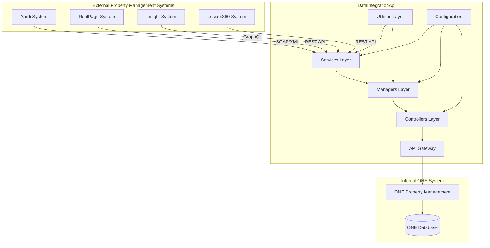
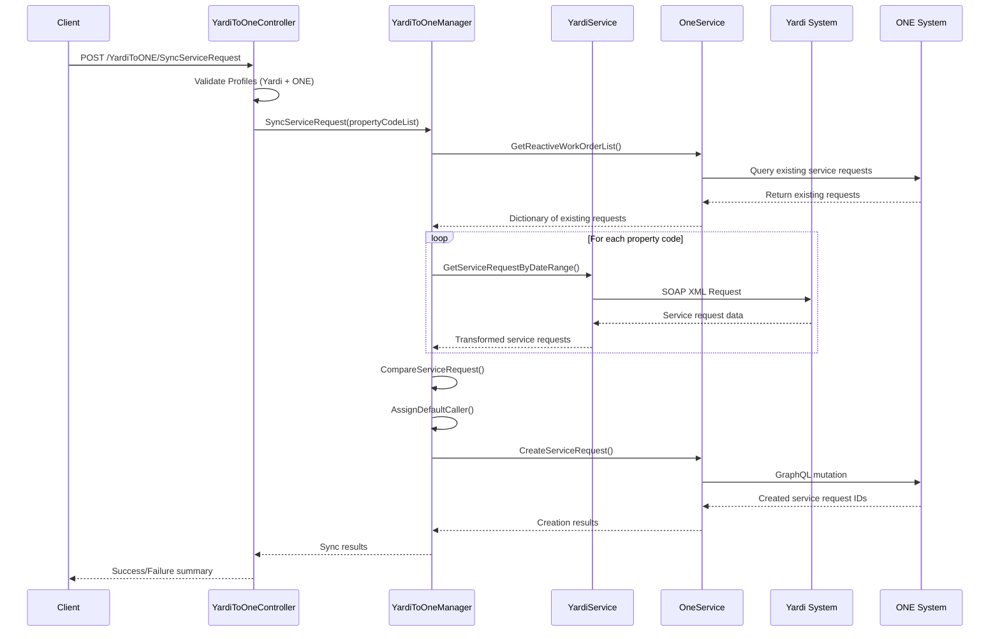
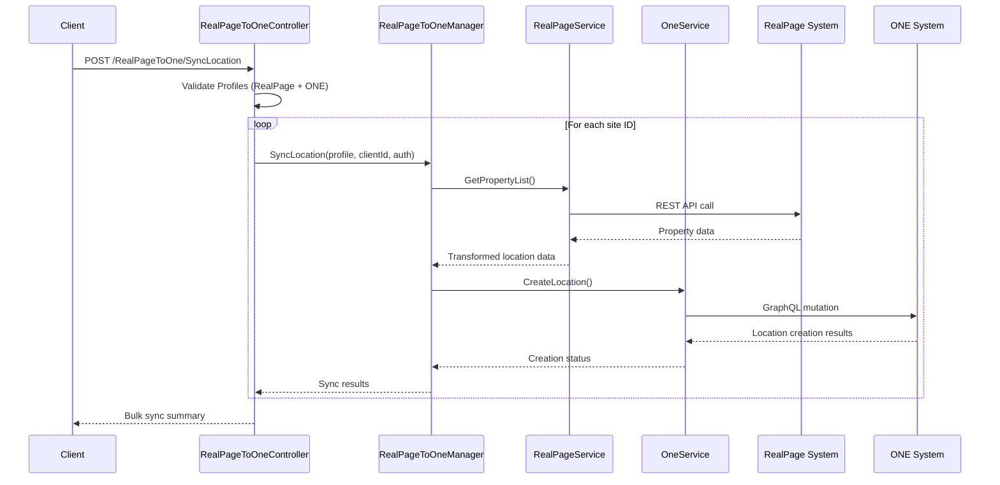
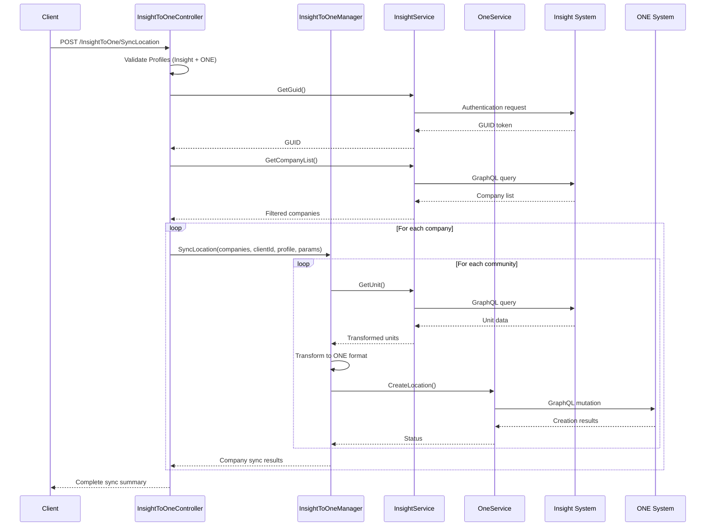
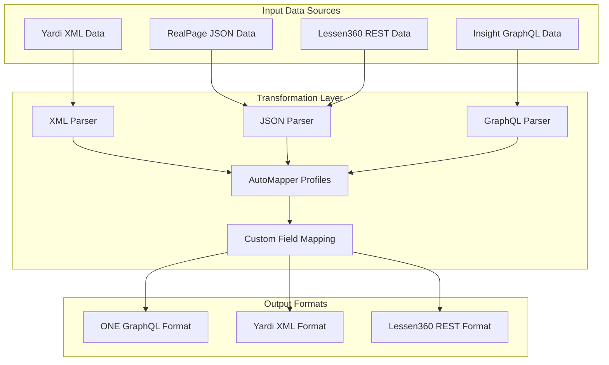
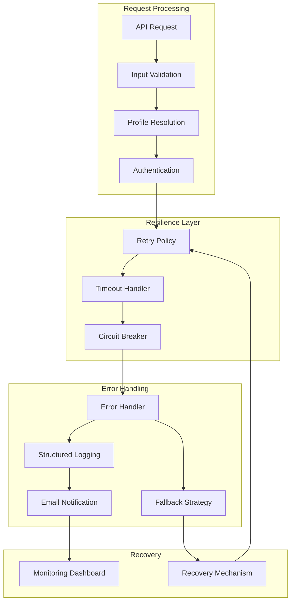
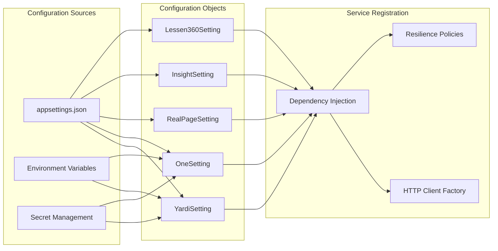
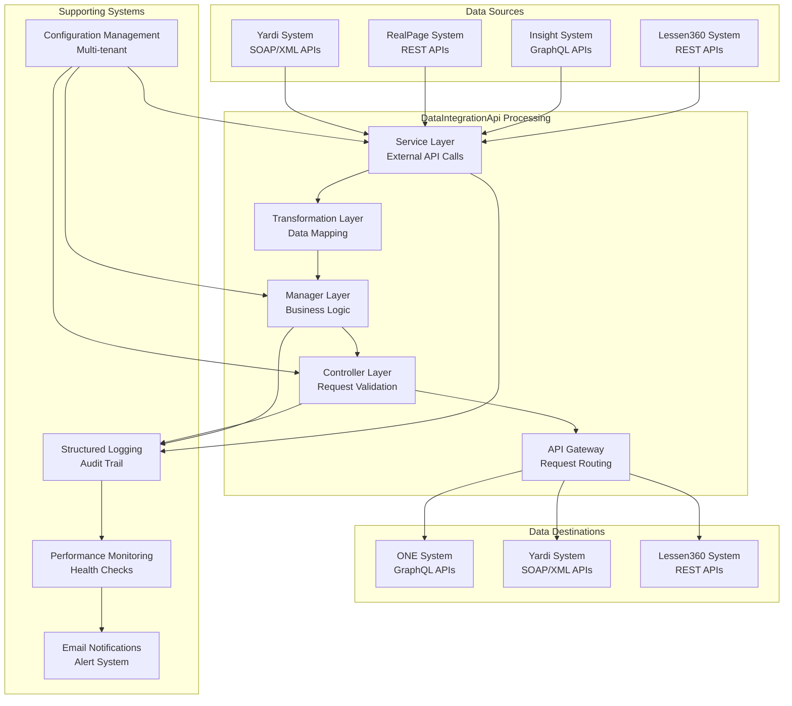

# DataIntegrationApi - Complete Flow Diagram

## System Architecture Overview

## Detailed Integration Flows

### 1. Yardi ↔ ONE Integration Flow

### 2. RealPage ↔ ONE Integration Flow

### 3. Insight → ONE Integration Flow

### 4. Cross-Platform Integration Flows

```mermaid
graph LR
    subgraph "RealPage ↔ Lessen360"
        RP[RealPage] -->|Property Data| RP_LESSEN[RealPageToLessen360Manager]
        RP_LESSEN -->|Transformed Data| LESSEN[Lessen360]
        LESSEN -->|Updates| RP_LESSEN
        RP_LESSEN -->|Sync Results| RP
    end

    subgraph "Yardi ↔ Lessen360"
        YARDI[Yardi] -->|Webhook Events| YARDI_LESSEN[YardiToLessen360Manager]
        YARDI_LESSEN -->|Real-time Sync| LESSEN[Lessen360]
        LESSEN -->|Status Updates| YARDI_LESSEN
        YARDI_LESSEN -->|Confirmation| YARDI
    end

    subgraph "ONE ↔ Yardi"
        ONE[ONE] -->|Service Requests| ONE_YARDI[OneToYardiManager]
        ONE_YARDI -->|Transformed Data| YARDI[Yardi]
        YARDI -->|Updates| ONE_YARDI
        ONE_YARDI -->|Sync Results| ONE
    end
```

## Data Transformation Flow

## Error Handling & Resilience Flow

## Configuration Management Flow

## API Endpoint Flow Map

```mermaid
graph TD
    subgraph "Main Controller Endpoints"
        SYNC[POST /Sync] --> COMMON_SYNC[Common Data Sync]
        SERVER_TIME[GET /GetServerTime] --> TIME_VALIDATION[Server Time Validation]
    end

    subgraph "Yardi Integration Endpoints"
        YARDI_SYNC[POST /YardiToONE/SyncServiceRequest] --> YARDI_SERVICE_SYNC[Service Request Sync]
        YARDI_ATTACH[POST /YardiToONE/SyncAttachmentUpdateToONE] --> YARDI_ATTACH_SYNC[Attachment Sync]
    end

    subgraph "RealPage Integration Endpoints"
        RP_LOCATION[POST /RealPageToOne/SyncLocation] --> RP_LOCATION_SYNC[Location Sync]
        RP_RESIDENT[POST /RealPageToOne/SyncResident] --> RP_RESIDENT_SYNC[Resident Sync]
        RP_SERVICE[POST /RealPageToOne/SyncServiceRequest] --> RP_SERVICE_SYNC[Service Request Sync]
    end

    subgraph "Insight Integration Endpoints"
        INSIGHT_LOCATION[POST /InsightToOne/SyncLocation] --> INSIGHT_LOCATION_SYNC[Location Sync]
        INSIGHT_LANDLORD[POST /InsightToOne/SyncLandlord] --> INSIGHT_LANDLORD_SYNC[Landlord Sync]
        INSIGHT_DELTA[POST /InsightToOne/SyncLocationByDeltaDate] --> INSIGHT_DELTA_SYNC[Delta Sync]
    end

    subgraph "Cross-Platform Endpoints"
        RP_LESSEN[POST /RealPageToLessen360/Sync] --> RP_LESSEN_SYNC[RealPage to Lessen360]
        YARDI_LESSEN[POST /YardiToLessen360/WebHook] --> YARDI_LESSEN_SYNC[Yardi to Lessen360 Webhook]
        ONE_YARDI[POST /ONEtoYardi/Sync] --> ONE_YARDI_SYNC[ONE to Yardi]
    end

    subgraph "Inbound Webhooks"
        INBOUND[DataIntegrationInboundController] --> WEBHOOK_PROCESSING[Webhook Processing]
        WEBHOOK_PROCESSING --> HMAC_VALIDATION[HMAC Validation]
        HMAC_VALIDATION --> REAL_TIME_SYNC[Real-time Sync]
    end
```

## Data Flow Summary

## Key Integration Patterns

### 1. **Pull Pattern** (Scheduled Sync)
- Yardi → ONE: Scheduled service request synchronization
- RealPage → ONE: Periodic location/resident sync
- Insight → ONE: Batch location/landlord sync

### 2. **Push Pattern** (Real-time Sync)
- Yardi → Lessen360: Webhook-based real-time updates
- ONE → Yardi: Immediate service request updates
- ONE → RealPage: Real-time data propagation

### 3. **Bidirectional Pattern** (Two-way Sync)
- Yardi ↔ ONE: Service requests and attachments
- RealPage ↔ Lessen360: Property and resident data
- ONE ↔ Yardi: Work order status updates

### 4. **Delta Sync Pattern** (Incremental Updates)
- Insight → ONE: Date-based incremental sync
- Yardi → ONE: Modified date filtering
- RealPage → ONE: Change-based synchronization

This comprehensive flow diagram shows the complete data integration architecture, highlighting the complex interactions between multiple property management systems and the robust processing pipeline within the DataIntegrationApi. 