# DataIntegrationApi - Complete Flow Graph Analysis

## 1. System Architecture Overview

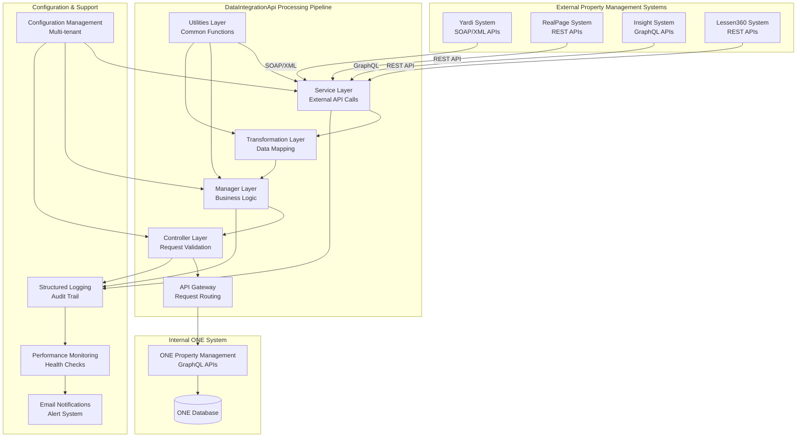

## 2. Detailed Integration Flow Patterns

### 2.1 Yardi ↔ ONE Integration Flow

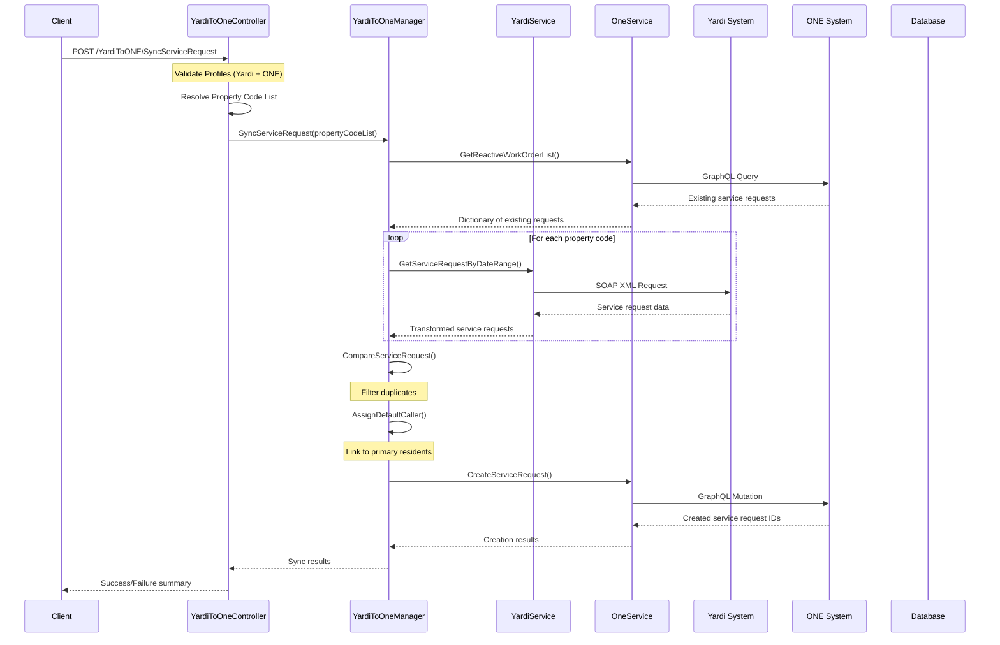

### 2.2 RealPage ↔ ONE Integration Flow

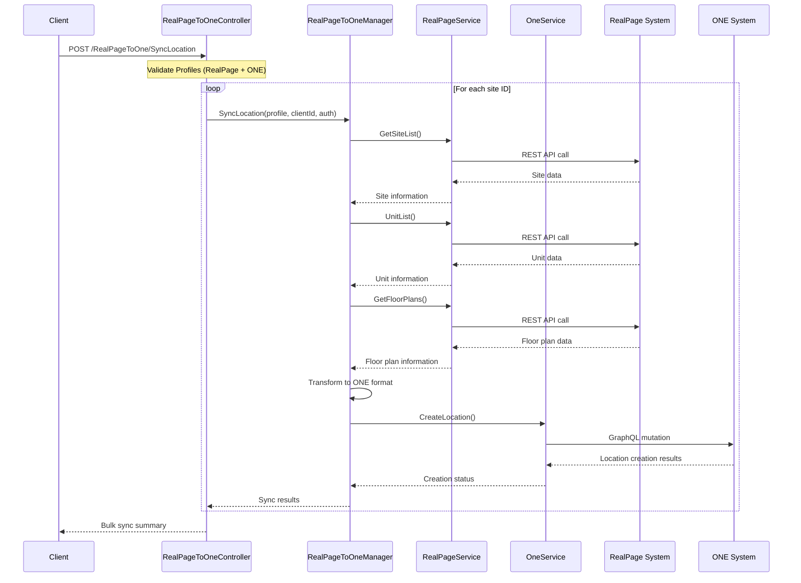

### 2.3 Insight → ONE Integration Flow

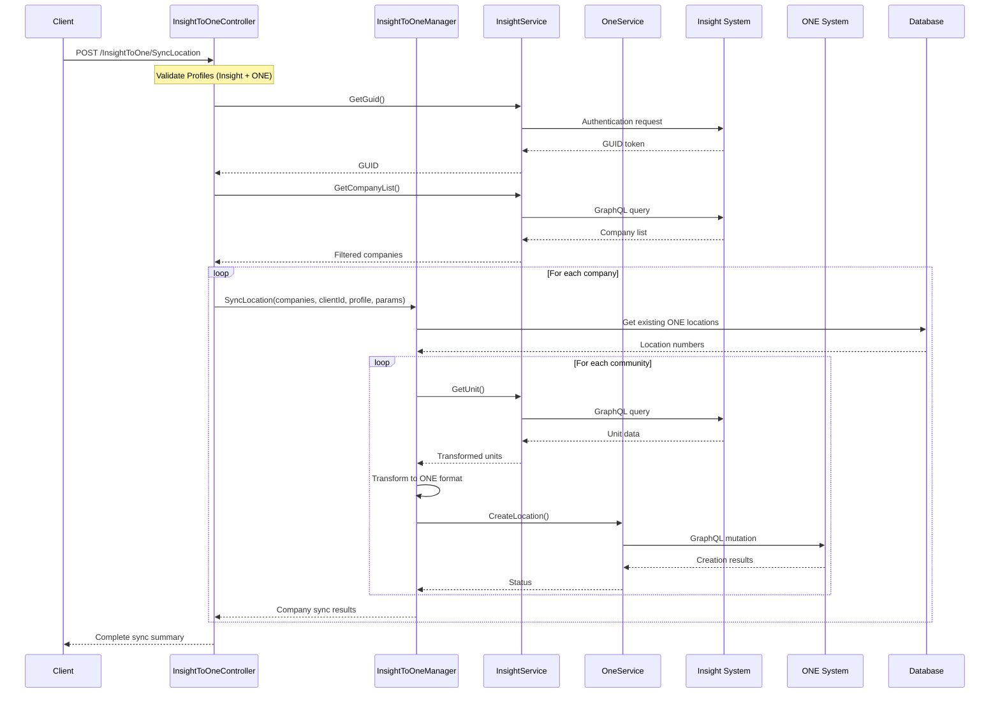

## 3. Cross-Platform Integration Flows

### 3.1 RealPage ↔ Lessen360 Integration

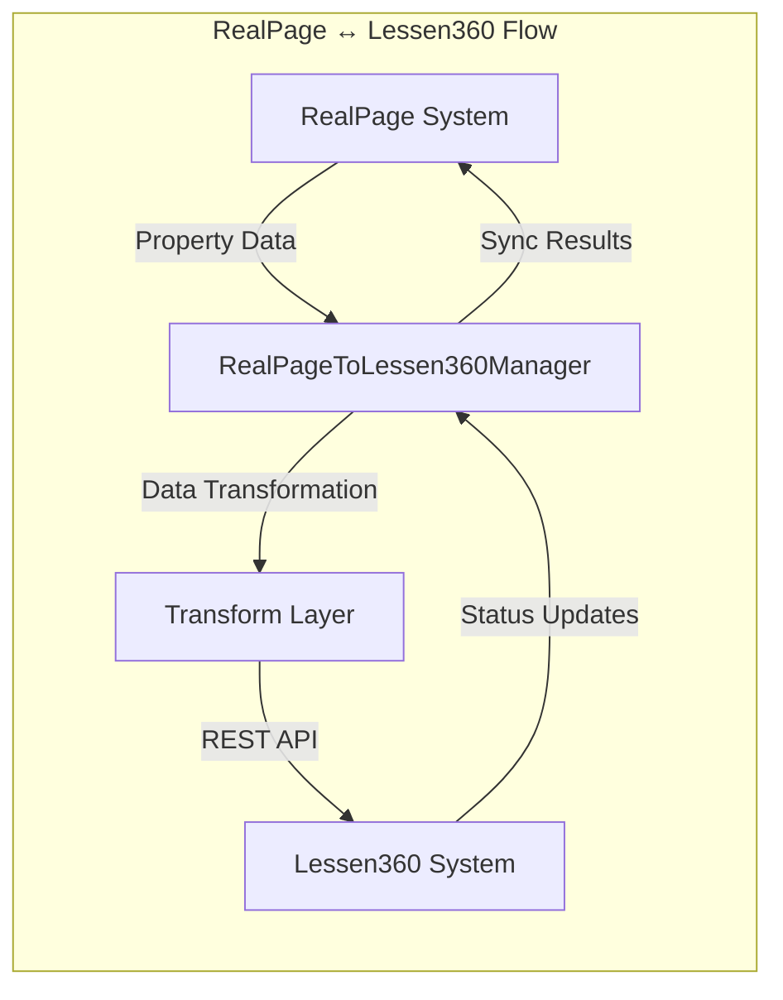

### 3.2 Yardi ↔ Lessen360 Webhook Flow

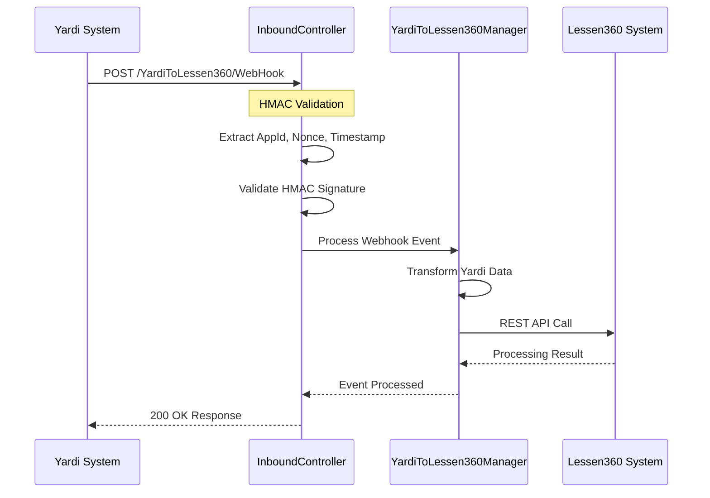

## 4. Data Transformation Flow

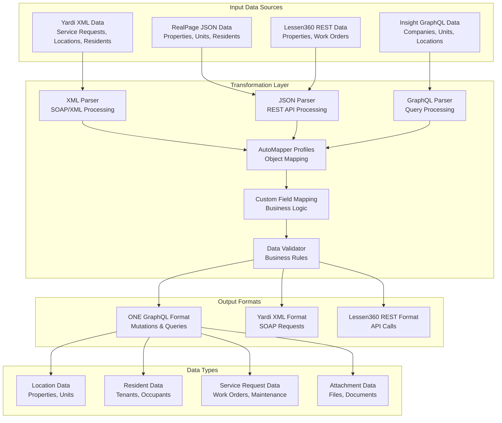

## 5. Error Handling & Resilience Flow

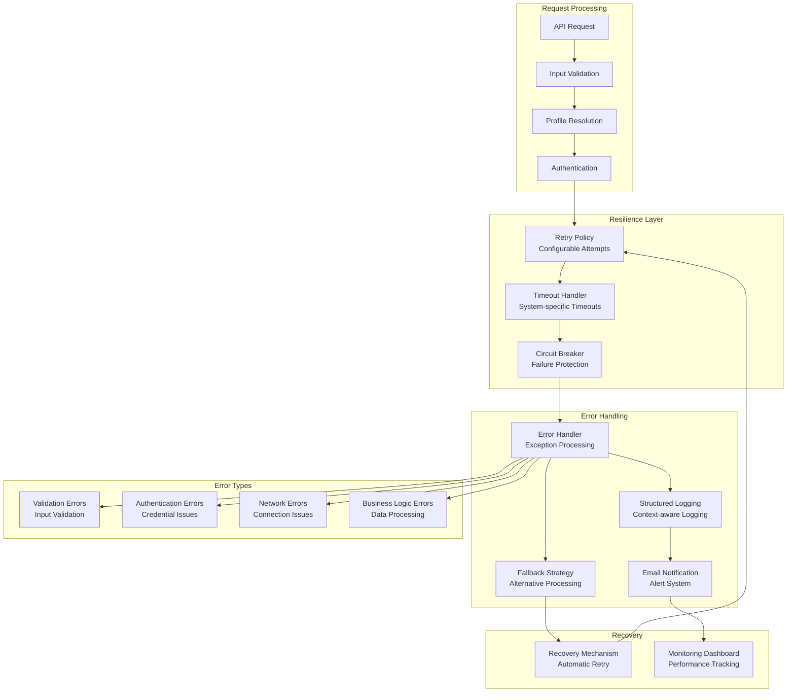

## 6. Configuration Management Flow

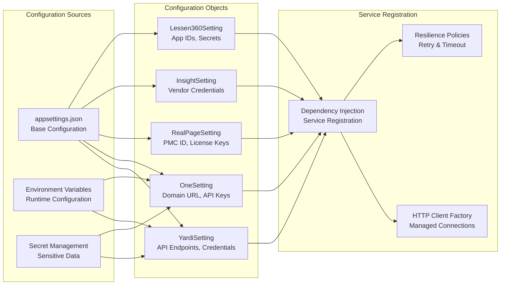

## 7. API Endpoint Flow Map

```mermaid
graph TD
    subgraph "Main Controller Endpoints"
        SYNC[POST /Sync<br/>General Data Sync] --> COMMON_SYNC[Common Data Sync<br/>Provider/Receiver Pattern]
        SERVER_TIME[GET /GetServerTime<br/>Server Time Validation] --> TIME_VALIDATION[Time Validation<br/>System Health Check]
    end

    subgraph "Yardi Integration Endpoints"
        YARDI_SYNC[POST /YardiToONE/SyncServiceRequest<br/>Service Request Sync] --> YARDI_SERVICE_SYNC[Service Request Processing<br/>Yardi → ONE]
        YARDI_ATTACH[POST /YardiToONE/SyncAttachmentUpdateToONE<br/>Attachment Sync] --> YARDI_ATTACH_SYNC[Attachment Processing<br/>File Upload/Download]
    end

    subgraph "RealPage Integration Endpoints"
        RP_LOCATION[POST /RealPageToOne/SyncLocation<br/>Location Sync] --> RP_LOCATION_SYNC[Location Processing<br/>RealPage → ONE]
        RP_RESIDENT[POST /RealPageToOne/SyncResident<br/>Resident Sync] --> RP_RESIDENT_SYNC[Resident Processing<br/>Tenant Data]
        RP_SERVICE[POST /RealPageToOne/SyncServiceRequest<br/>Service Request Sync] --> RP_SERVICE_SYNC[Service Request Processing<br/>Work Orders]
    end

    subgraph "Insight Integration Endpoints"
        INSIGHT_LOCATION[POST /InsightToOne/SyncLocation<br/>Location Sync] --> INSIGHT_LOCATION_SYNC[Location Processing<br/>Insight → ONE]
        INSIGHT_LANDLORD[POST /InsightToOne/SyncLandlord<br/>Landlord Sync] --> INSIGHT_LANDLORD_SYNC[Landlord Processing<br/>Owner Data]
        INSIGHT_DELTA[POST /InsightToOne/SyncLocationByDeltaDate<br/>Delta Sync] --> INSIGHT_DELTA_SYNC[Delta Processing<br/>Incremental Updates]
    end

    subgraph "Cross-Platform Endpoints"
        RP_LESSEN[POST /RealPageToLessen360/Sync<br/>RealPage → Lessen360] --> RP_LESSEN_SYNC[Cross-Platform Sync<br/>Property Data Exchange]
        YARDI_LESSEN[POST /YardiToLessen360/WebHook<br/>Yardi → Lessen360] --> YARDI_LESSEN_SYNC[Webhook Processing<br/>Real-time Events]
        ONE_YARDI[POST /ONEtoYardi/Sync<br/>ONE → Yardi] --> ONE_YARDI_SYNC[Bidirectional Sync<br/>Status Updates]
    end

    subgraph "Inbound Webhooks"
        INBOUND[DataIntegrationInboundController<br/>Webhook Processing] --> WEBHOOK_PROCESSING[Webhook Validation<br/>HMAC Authentication]
        WEBHOOK_PROCESSING --> HMAC_VALIDATION[HMAC Validation<br/>Security Check]
        HMAC_VALIDATION --> REAL_TIME_SYNC[Real-time Sync<br/>Event Processing]
    end
```

## 8. Data Flow Summary

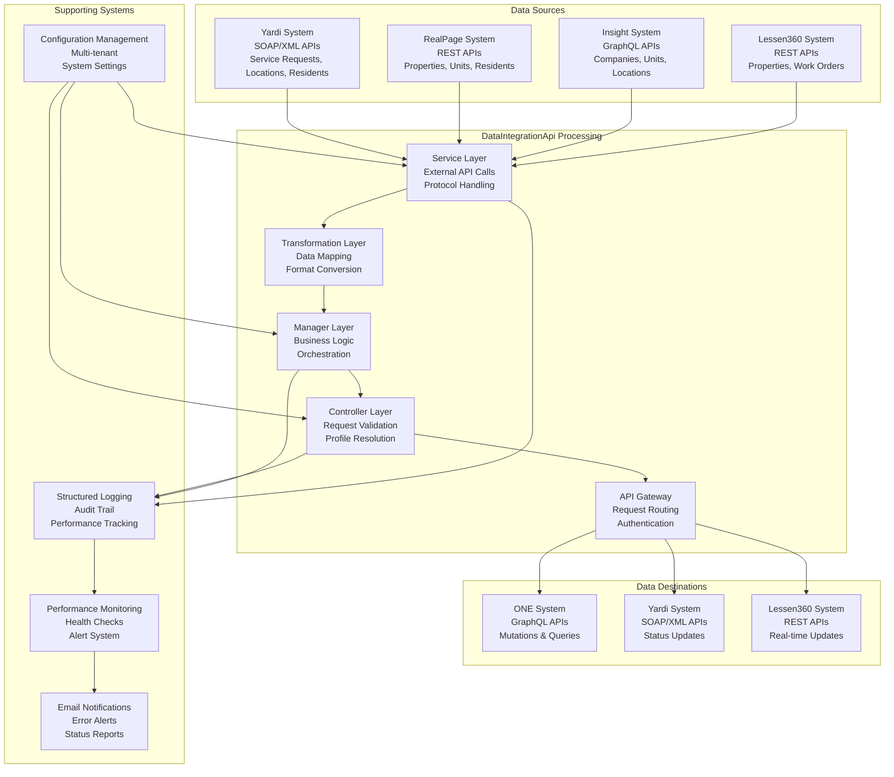

## 9. Key Integration Patterns

### 9.1 Pull Pattern (Scheduled Sync)
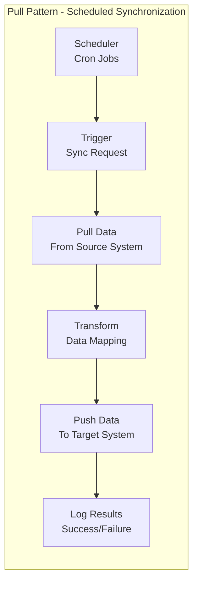

### 9.2 Push Pattern (Real-time Sync)
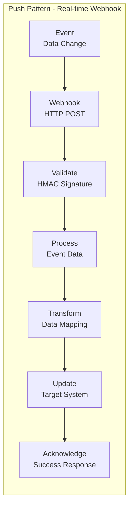

### 9.3 Bidirectional Pattern (Two-way Sync)
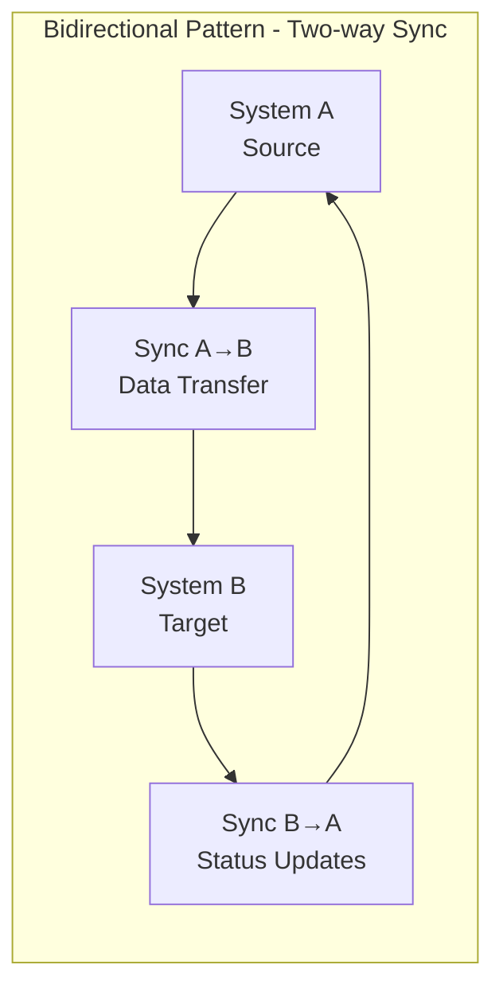

### 9.4 Delta Pattern (Incremental Updates)
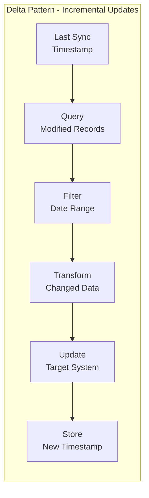

## 10. Complete Flow Summary

This comprehensive flow graph analysis shows the complete data integration architecture of the DataIntegrationApi, highlighting:

### **Key Components:**
1. **Multi-System Integration** - Yardi, RealPage, Insight, Lessen360, ONE
2. **Protocol Support** - SOAP/XML, REST API, GraphQL, Webhooks
3. **Data Transformation** - Complex mapping between different system formats
4. **Error Handling** - Comprehensive retry, timeout, and circuit breaker patterns
5. **Configuration Management** - Multi-tenant, system-specific settings
6. **Monitoring & Logging** - Complete audit trail and performance tracking

### **Integration Patterns:**
- **Pull Pattern** - Scheduled synchronization for bulk data
- **Push Pattern** - Real-time webhook processing for immediate updates
- **Bidirectional Pattern** - Two-way data exchange between systems
- **Delta Pattern** - Incremental updates for efficiency

### **Data Flow:**
- **Source Systems** → **Service Layer** → **Transformation Layer** → **Manager Layer** → **Controller Layer** → **API Gateway** → **Target Systems**

This architecture provides a robust, scalable, and maintainable solution for complex data synchronization between multiple property management systems. 