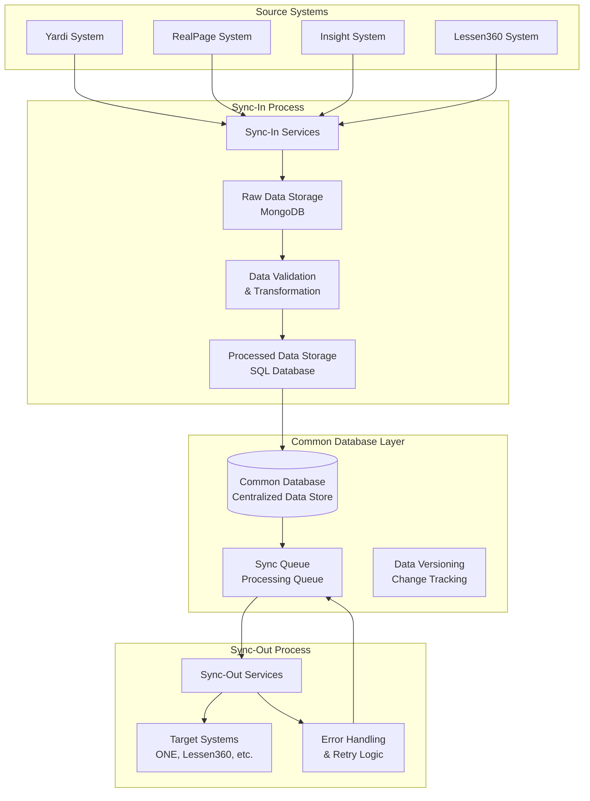
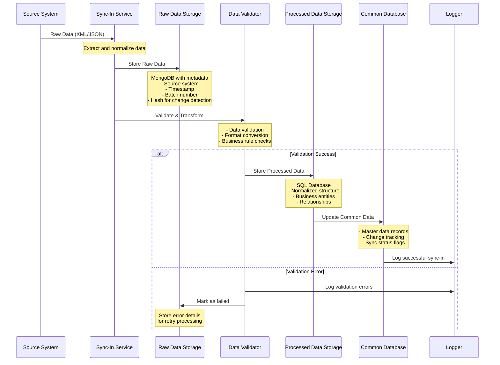
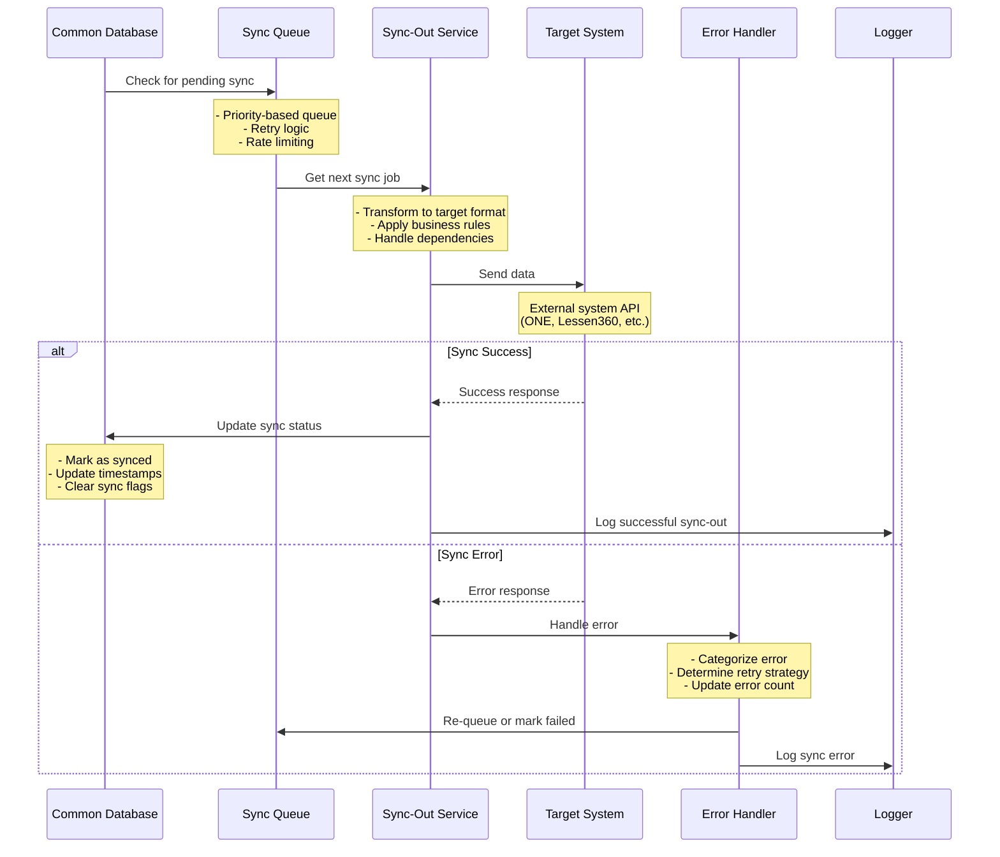
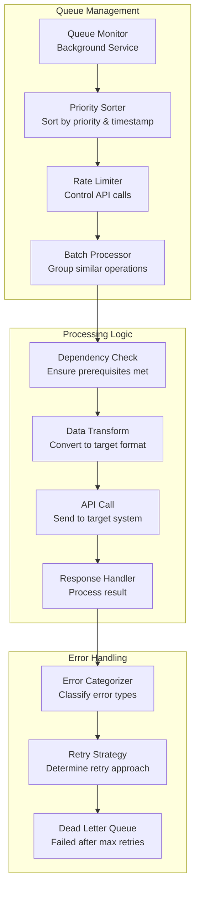
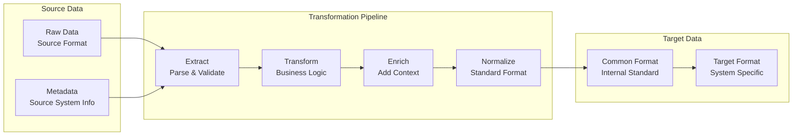

# DataIntegrationApi - Separated Sync Flow Design

## Overview
This document provides a comprehensive design for separating sync-in and sync-out processes in the DataIntegrationApi, using a common database as the intermediary layer. This approach provides better scalability, reliability, and maintainability.

## Current Architecture Analysis

### Existing Data Storage Patterns
Based on the current codebase analysis, the system already has some foundation for this approach:

1. **MongoDB Raw Data Storage**: `ClientRawData` and `ClientOpenAPIInboundDataMapping`
2. **SQL Database**: `client_Location`, `client_LocationResidential` for processed data
3. **Batch Processing**: Existing batch number tracking and data versioning

## Proposed Separated Sync Architecture

### 1. High-Level Architecture Flow



### 2. Detailed Sync-In Flow



### 3. Detailed Sync-Out Flow



## 4. Database Schema Design

### 4.1 Common Database Tables

```sql
-- Master data tables
CREATE TABLE sync_master_data (
    id BIGINT PRIMARY KEY AUTO_INCREMENT,
    entity_type VARCHAR(50) NOT NULL, -- 'Location', 'Resident', 'ServiceRequest'
    entity_id VARCHAR(100) NOT NULL,
    source_system VARCHAR(50) NOT NULL, -- 'Yardi', 'RealPage', 'Insight'
    source_id VARCHAR(100) NOT NULL,
    data_hash VARCHAR(64) NOT NULL,
    sync_status ENUM('pending', 'synced', 'failed', 'retry') DEFAULT 'pending',
    last_sync_attempt DATETIME,
    sync_attempt_count INT DEFAULT 0,
    error_message TEXT,
    created_date DATETIME DEFAULT CURRENT_TIMESTAMP,
    modified_date DATETIME DEFAULT CURRENT_TIMESTAMP ON UPDATE CURRENT_TIMESTAMP,
    UNIQUE KEY unique_entity (entity_type, entity_id, source_system)
);

-- Sync queue table
CREATE TABLE sync_queue (
    id BIGINT PRIMARY KEY AUTO_INCREMENT,
    master_data_id BIGINT NOT NULL,
    target_system VARCHAR(50) NOT NULL, -- 'ONE', 'Lessen360'
    priority INT DEFAULT 5, -- 1=highest, 10=lowest
    retry_count INT DEFAULT 0,
    max_retries INT DEFAULT 3,
    next_retry_time DATETIME,
    created_date DATETIME DEFAULT CURRENT_TIMESTAMP,
    FOREIGN KEY (master_data_id) REFERENCES sync_master_data(id)
);

-- Data versioning table
CREATE TABLE data_versions (
    id BIGINT PRIMARY KEY AUTO_INCREMENT,
    master_data_id BIGINT NOT NULL,
    version_number INT NOT NULL,
    data_snapshot JSON,
    change_type ENUM('create', 'update', 'delete'),
    created_date DATETIME DEFAULT CURRENT_TIMESTAMP,
    FOREIGN KEY (master_data_id) REFERENCES sync_master_data(id)
);
```

### 4.2 Enhanced MongoDB Schema

```javascript
// Enhanced ClientRawData collection
{
  "_id": ObjectId,
  "sourceSystem": "Yardi|RealPage|Insight|Lessen360",
  "sourceId": "string",
  "entityType": "Location|Resident|ServiceRequest|Attachment",
  "rawData": {
    // Original data from source system
  },
  "processedData": {
    // Normalized data after validation
  },
  "metadata": {
    "batchNumber": "long",
    "syncDate": "datetime",
    "hash": "string",
    "version": "int"
  },
  "syncStatus": {
    "inbound": "pending|completed|failed",
    "outbound": {
      "ONE": "pending|synced|failed",
      "Lessen360": "pending|synced|failed"
    }
  },
  "errorLog": [{
    "timestamp": "datetime",
    "error": "string",
    "retryCount": "int"
  }],
  "createDate": "datetime",
  "expiresAfter": "datetime"
}
```

## 5. Service Architecture

### 5.1 Sync-In Services

```csharp
// Base Sync-In Service
public abstract class BaseSyncInService<T>
{
    protected readonly IRawDataRepository _rawDataRepo;
    protected readonly IProcessedDataRepository _processedDataRepo;
    protected readonly ICommonDataRepository _commonDataRepo;
    protected readonly IDataValidator<T> _validator;
    protected readonly ILogger _logger;

    public async Task<SyncInResult> SyncInAsync(T sourceData, string sourceSystem)
    {
        try
        {
            // 1. Store raw data
            var rawDataId = await StoreRawDataAsync(sourceData, sourceSystem);
            
            // 2. Validate and transform
            var validationResult = await ValidateAndTransformAsync(sourceData);
            
            if (validationResult.IsValid)
            {
                // 3. Store processed data
                var processedDataId = await StoreProcessedDataAsync(validationResult.ProcessedData);
                
                // 4. Update common database
                var masterDataId = await UpdateCommonDataAsync(processedDataId, sourceSystem);
                
                // 5. Queue for sync-out
                await QueueForSyncOutAsync(masterDataId);
                
                return SyncInResult.Success(masterDataId);
            }
            else
            {
                await MarkRawDataAsFailedAsync(rawDataId, validationResult.Errors);
                return SyncInResult.Failed(validationResult.Errors);
            }
        }
        catch (Exception ex)
        {
            _logger.Error($"Sync-in failed for {sourceSystem}: {ex.Message}");
            return SyncInResult.Failed(new[] { ex.Message });
        }
    }
}

// Yardi Sync-In Service
public class YardiSyncInService : BaseSyncInService<YardiServiceRequest>
{
    public async Task<SyncInResult> SyncServiceRequestsAsync(List<YardiServiceRequest> requests)
    {
        var results = new List<SyncInResult>();
        
        foreach (var request in requests)
        {
            var result = await SyncInAsync(request, "Yardi");
            results.Add(result);
        }
        
        return SyncInResult.Batch(results);
    }
}
```

### 5.2 Sync-Out Services

```csharp
// Base Sync-Out Service
public abstract class BaseSyncOutService<T>
{
    protected readonly ISyncQueueRepository _queueRepo;
    protected readonly ICommonDataRepository _commonDataRepo;
    protected readonly ITargetSystemClient<T> _targetClient;
    protected readonly ILogger _logger;

    public async Task<SyncOutResult> ProcessQueueAsync()
    {
        var pendingItems = await _queueRepo.GetPendingItemsAsync();
        
        foreach (var item in pendingItems)
        {
            try
            {
                var result = await SyncOutAsync(item);
                
                if (result.IsSuccess)
                {
                    await MarkAsSyncedAsync(item.Id);
                }
                else
                {
                    await HandleSyncErrorAsync(item, result.Error);
                }
            }
            catch (Exception ex)
            {
                await HandleSyncErrorAsync(item, ex.Message);
            }
        }
    }

    protected abstract Task<SyncOutResult> SyncOutAsync(SyncQueueItem item);
}

// ONE Sync-Out Service
public class OneSyncOutService : BaseSyncOutService<OneServiceRequest>
{
    protected override async Task<SyncOutResult> SyncOutAsync(SyncQueueItem item)
    {
        var data = await _commonDataRepo.GetDataAsync(item.MasterDataId);
        var oneRequest = TransformToOneFormat(data);
        
        var response = await _targetClient.CreateServiceRequestAsync(oneRequest);
        
        return response.IsSuccess 
            ? SyncOutResult.Success(response.Id)
            : SyncOutResult.Failed(response.Error);
    }
}
```

## 6. Queue Management System

### 6.1 Queue Processing Flow



### 6.2 Queue Configuration

```csharp
public class SyncQueueConfiguration
{
    public int MaxConcurrentProcessors { get; set; } = 5;
    public int BatchSize { get; set; } = 100;
    public TimeSpan ProcessingInterval { get; set; } = TimeSpan.FromSeconds(30);
    public TimeSpan RetryInterval { get; set; } = TimeSpan.FromMinutes(5);
    public int MaxRetryAttempts { get; set; } = 3;
    
    public Dictionary<string, RateLimitConfig> RateLimits { get; set; } = new()
    {
        ["ONE"] = new RateLimitConfig { RequestsPerMinute = 60 },
        ["Lessen360"] = new RateLimitConfig { RequestsPerMinute = 30 }
    };
}
```

## 7. Data Transformation Pipeline

### 7.1 Transformation Flow



### 7.2 Transformation Rules Engine

```csharp
public class DataTransformationEngine
{
    private readonly Dictionary<string, ITransformationRule> _rules;
    
    public async Task<TransformedData> TransformAsync(
        SourceData sourceData, 
        string targetSystem)
    {
        var transformedData = new TransformedData();
        
        // Apply common transformation rules
        foreach (var rule in _rules.Values.Where(r => r.IsCommon))
        {
            transformedData = await rule.ApplyAsync(transformedData, sourceData);
        }
        
        // Apply system-specific transformation rules
        var systemRules = _rules.Values.Where(r => r.TargetSystem == targetSystem);
        foreach (var rule in systemRules)
        {
            transformedData = await rule.ApplyAsync(transformedData, sourceData);
        }
        
        return transformedData;
    }
}

public interface ITransformationRule
{
    string Name { get; }
    string TargetSystem { get; }
    bool IsCommon { get; }
    Task<TransformedData> ApplyAsync(TransformedData data, SourceData source);
}
```

## 8. Monitoring and Observability

### 8.1 Health Check System

```csharp
public class SyncHealthCheckService : IHealthCheck
{
    public async Task<HealthCheckResult> CheckHealthAsync(HealthCheckContext context)
    {
        var checks = new List<HealthCheckItem>();
        
        // Check queue health
        checks.Add(await CheckQueueHealthAsync());
        
        // Check database connectivity
        checks.Add(await CheckDatabaseHealthAsync());
        
        // Check external system connectivity
        checks.Add(await CheckExternalSystemsHealthAsync());
        
        // Check processing performance
        checks.Add(await CheckPerformanceMetricsAsync());
        
        var isHealthy = checks.All(c => c.IsHealthy);
        var description = string.Join("; ", checks.Select(c => c.Description));
        
        return isHealthy 
            ? HealthCheckResult.Healthy(description)
            : HealthCheckResult.Unhealthy(description);
    }
}
```

### 8.2 Metrics and Dashboards

```csharp
public class SyncMetrics
{
    // Sync-In Metrics
    public Counter SyncInRequests { get; set; }
    public Counter SyncInSuccess { get; set; }
    public Counter SyncInFailures { get; set; }
    public Histogram SyncInProcessingTime { get; set; }
    
    // Sync-Out Metrics
    public Counter SyncOutRequests { get; set; }
    public Counter SyncOutSuccess { get; set; }
    public Counter SyncOutFailures { get; set; }
    public Histogram SyncOutProcessingTime { get; set; }
    
    // Queue Metrics
    public Gauge QueueLength { get; set; }
    public Gauge QueueProcessingRate { get; set; }
    public Counter QueueRetries { get; set; }
    
    // System Metrics
    public Gauge DatabaseConnections { get; set; }
    public Gauge ExternalSystemLatency { get; set; }
}
```

## 9. Implementation Benefits

### 9.1 Scalability Benefits
- **Independent Scaling**: Sync-in and sync-out can scale independently
- **Batch Processing**: Efficient handling of large data volumes
- **Parallel Processing**: Multiple sync operations can run concurrently
- **Queue Management**: Better resource utilization and load balancing

### 9.2 Reliability Benefits
- **Data Persistence**: Raw data is preserved for debugging and reprocessing
- **Error Recovery**: Failed syncs can be retried without data loss
- **Change Tracking**: Version control for data changes
- **Audit Trail**: Complete history of data transformations

### 9.3 Maintainability Benefits
- **Separation of Concerns**: Clear boundaries between sync-in and sync-out
- **Modular Design**: Easy to add new source or target systems
- **Configuration Driven**: Business rules can be changed without code deployment
- **Monitoring**: Comprehensive observability and alerting

## 10. Migration Strategy

### 10.1 Phase 1: Infrastructure Setup
1. Set up common database schema
2. Implement queue management system
3. Create monitoring and metrics infrastructure

### 10.2 Phase 2: Sync-In Implementation
1. Implement sync-in services for each source system
2. Set up data validation and transformation pipelines
3. Migrate existing sync-in logic to new architecture

### 10.3 Phase 3: Sync-Out Implementation
1. Implement sync-out services for each target system
2. Set up queue processing and error handling
3. Migrate existing sync-out logic to new architecture

### 10.4 Phase 4: Testing and Optimization
1. Comprehensive testing of all sync scenarios
2. Performance optimization and tuning
3. Production deployment with gradual rollout

This separated sync architecture provides a robust, scalable, and maintainable solution for data integration, with clear separation between data ingestion and distribution processes. 