# DataIntegrationApi - Sync Scenarios Flow Analysis

## Overview
This document provides detailed visual flow analysis for different sync scenarios when synchronizing data to destination systems in the DataIntegrationApi.

## 1. Yardi → ONE Sync Scenarios

### 1.1 Service Request Sync Flow

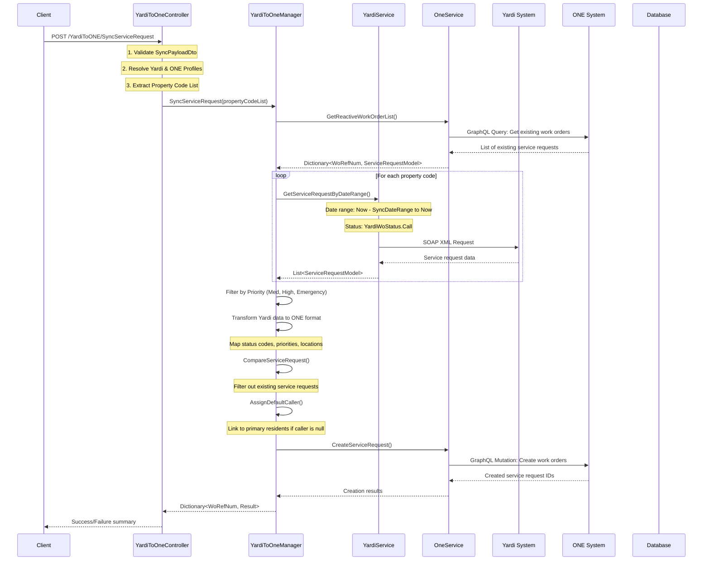

### 1.2 Attachment Sync Flow

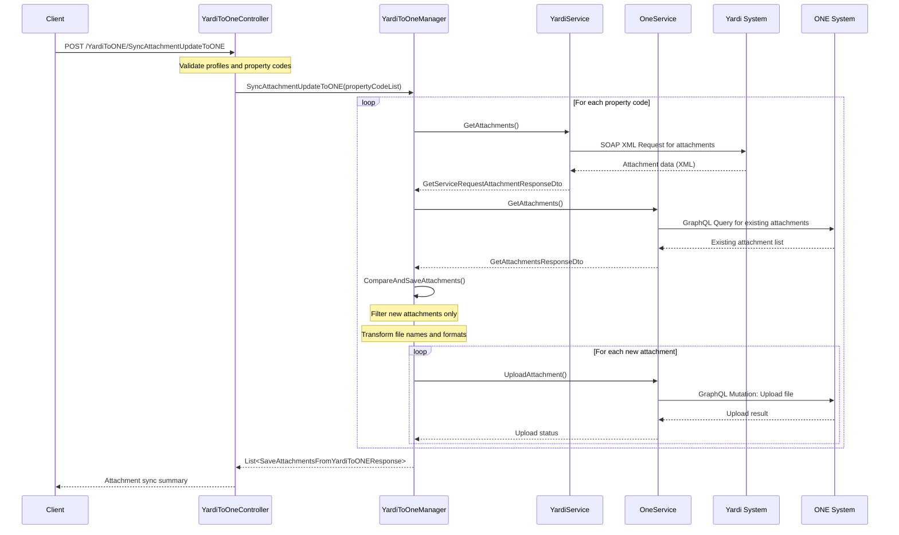

## 2. RealPage → ONE Sync Scenarios

### 2.1 Location Sync Flow

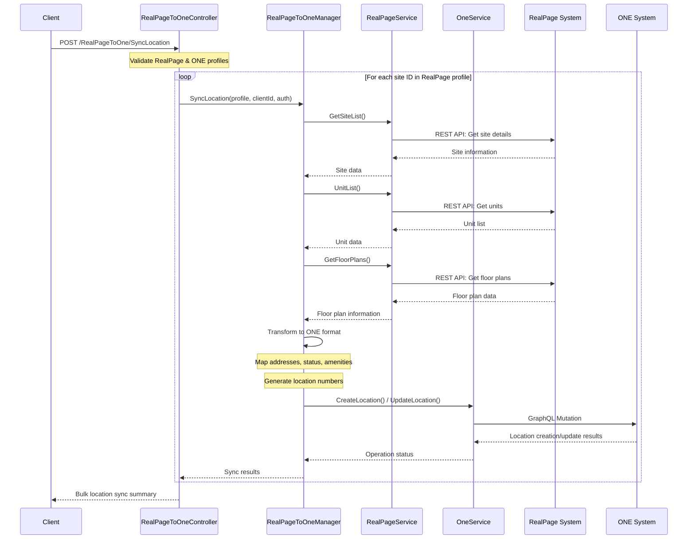

### 2.2 Resident Sync Flow

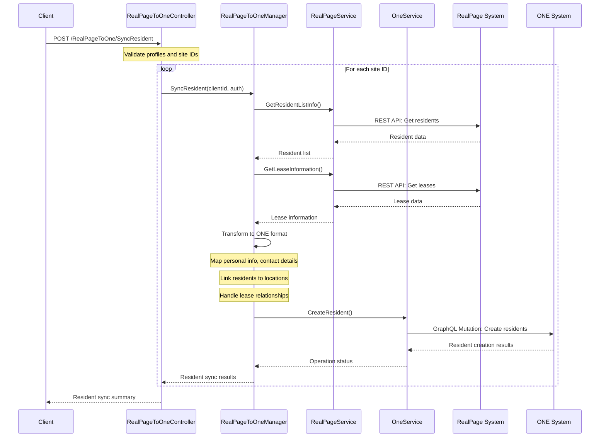

## 3. Insight → ONE Sync Scenarios

### 3.1 Location Sync Flow (Complex Multi-Step)

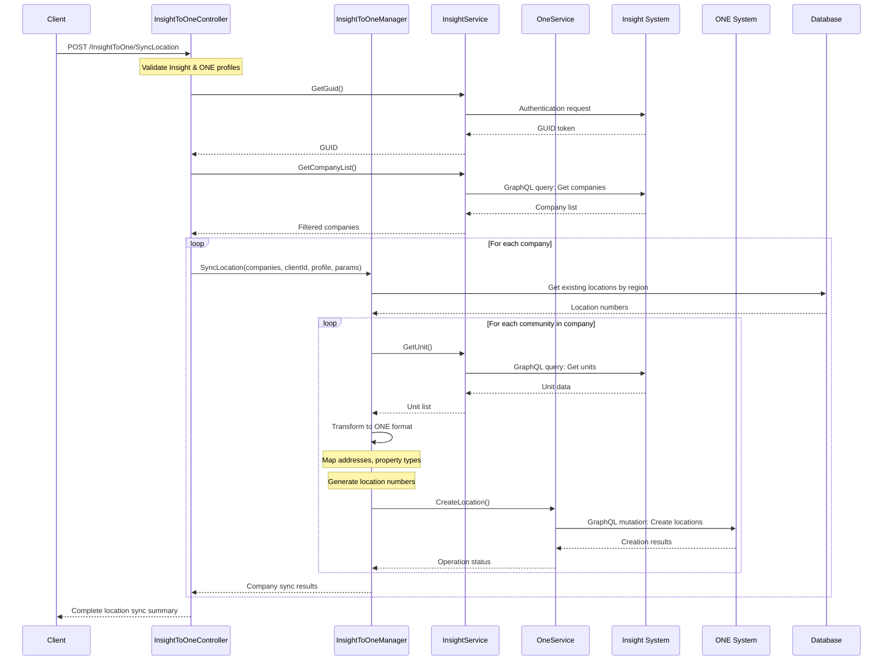

### 3.2 Landlord Sync Flow

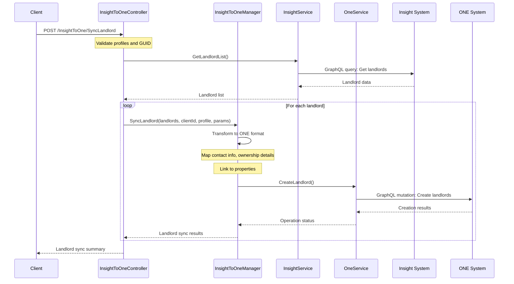

## 4. Cross-Platform Sync Scenarios

### 4.1 RealPage → Lessen360 Sync Flow

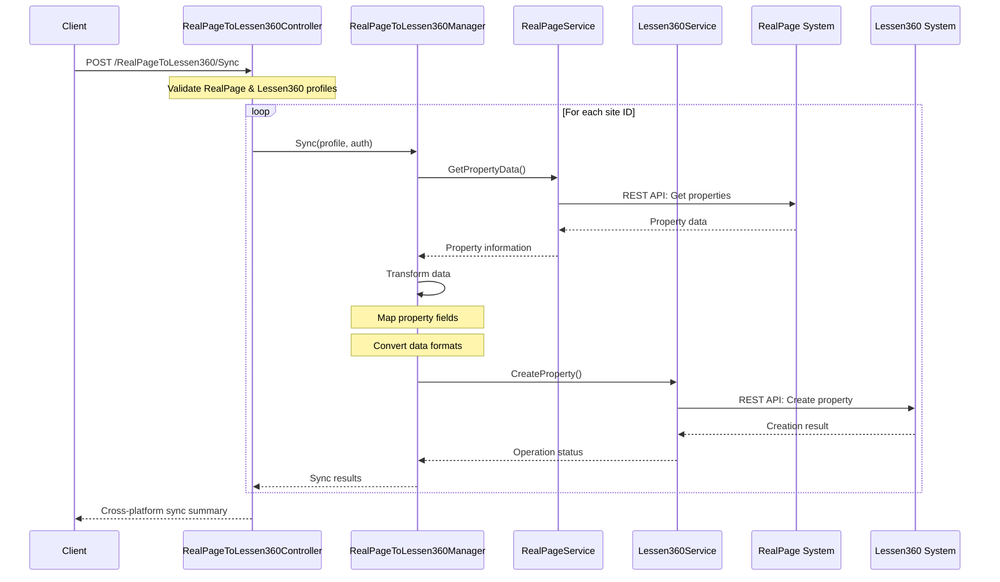

### 4.2 Yardi → Lessen360 Webhook Flow

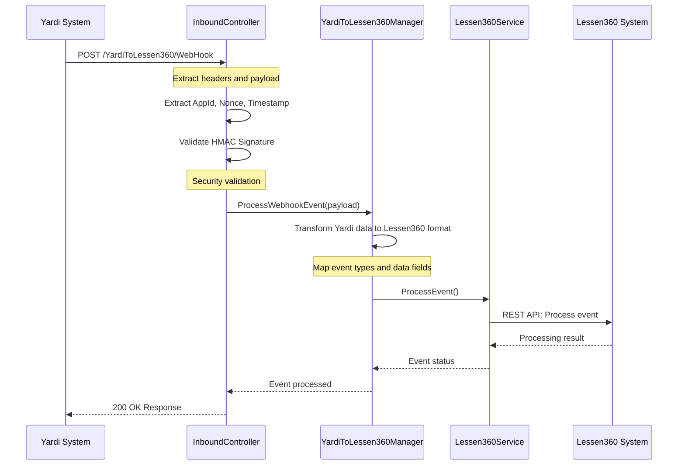

## 5. Data Transformation Flow Diagrams

### 5.1 Yardi Service Request Transformation

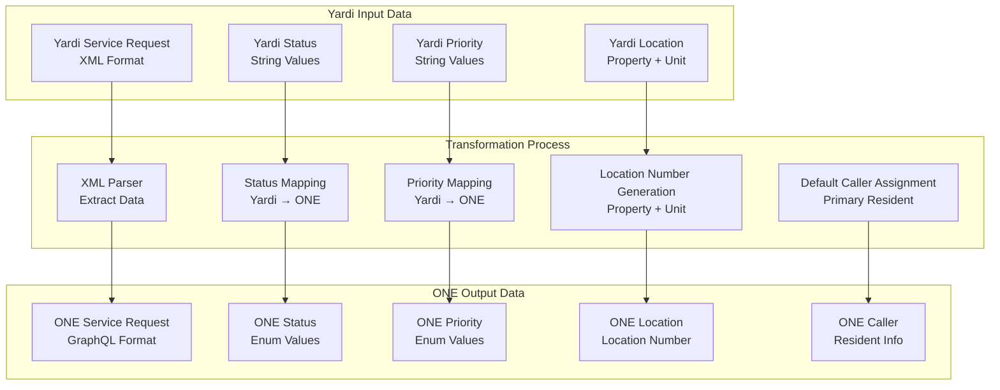

### 5.2 RealPage Location Transformation

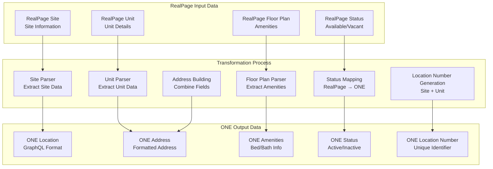

### 5.3 Insight Location Transformation

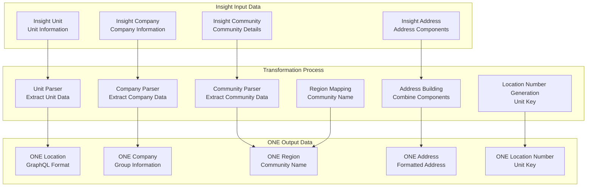

## 6. Error Handling Scenarios

### 6.1 Network Error Handling Flow

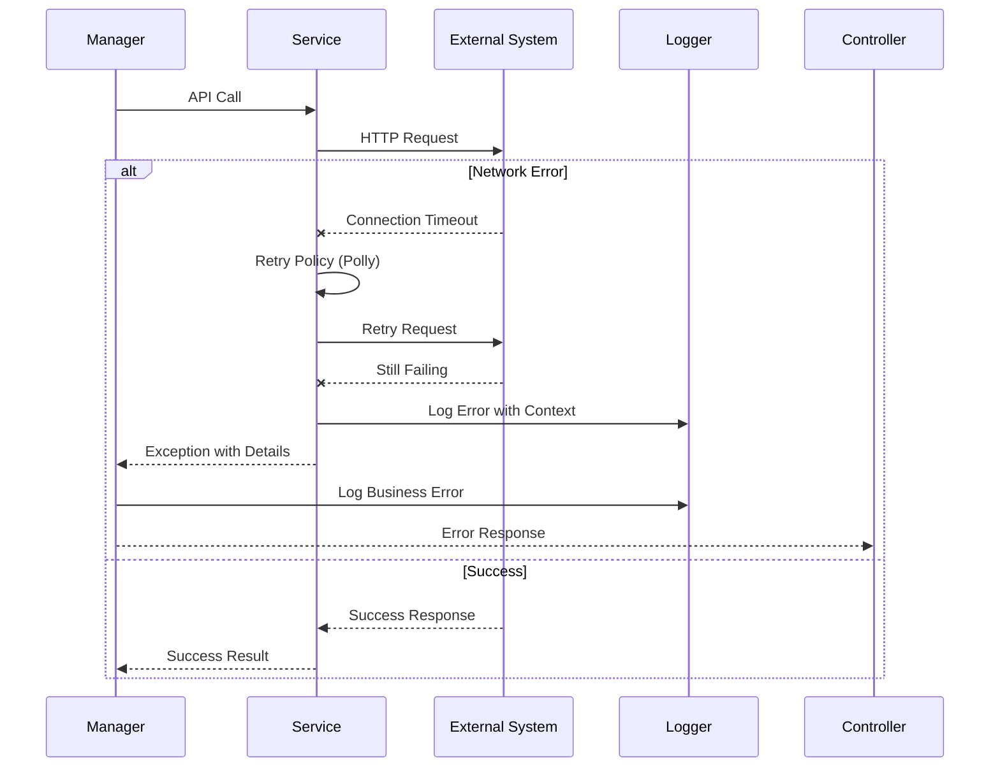

### 6.2 Data Validation Error Flow

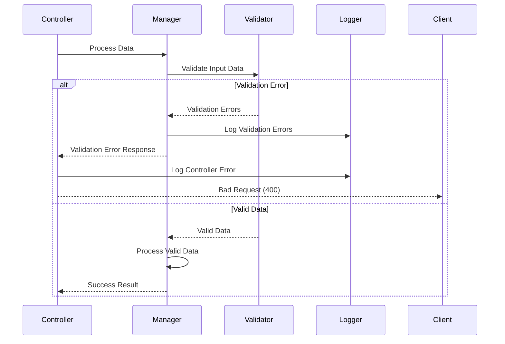

## 7. Performance Optimization Flows

### 7.1 Batch Processing Flow

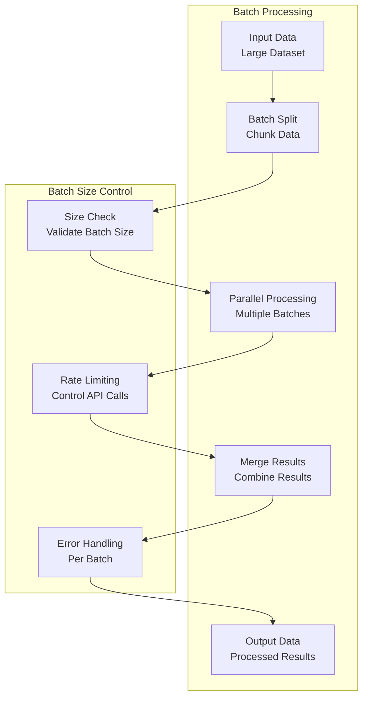

### 7.2 Caching Strategy Flow

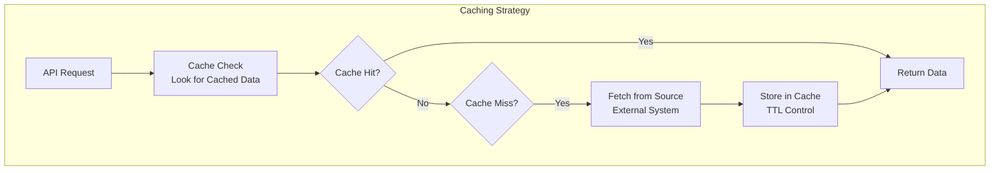

## 8. Complete Sync Scenario Summary

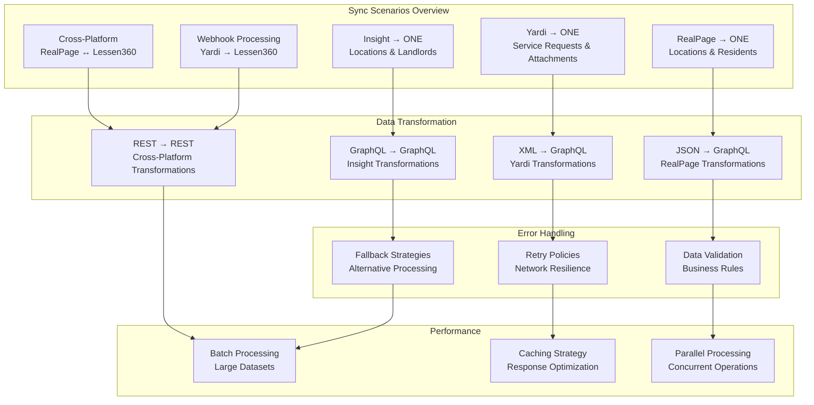

This comprehensive flow analysis shows the detailed sync scenarios for different destination systems, highlighting the specific data transformations, error handling patterns, and performance optimizations used in the DataIntegrationApi. 