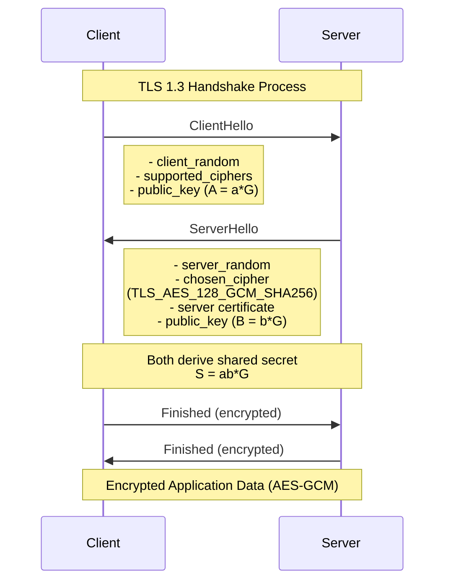

# TLS 1.3 Handshake Diagram

## Key Components

### ClientHello
- **client_random**: 32-byte random value for key derivation
- **supported_ciphers**: List of supported cipher suites
- **public_key (A = a*G)**: Client's ephemeral public key for ECDHE

### ServerHello
- **server_random**: 32-byte random value for key derivation
- **chosen_cipher**: Selected cipher suite (e.g., TLS_AES_128_GCM_SHA256)
- **server certificate**: Server's digital certificate for authentication
- **public_key (B = b*G)**: Server's ephemeral public key for ECDHE

### Key Exchange
Both parties compute the shared secret: **S = ab*G**

### Security Features
- **Forward Secrecy**: Each session uses new ephemeral keys
- **Authentication**: Server certificate verification
- **Encryption**: AES-GCM for application data
- **Integrity**: Built into AES-GCM mode

## Cipher Suite Details
**TLS_AES_128_GCM_SHA256**:
- **Key Exchange**: ECDHE (Elliptic Curve Diffie-Hellman Ephemeral)
- **Authentication**: RSA/ECDSA (via certificate)
- **Encryption**: AES-128 in GCM mode
- **Hash**: SHA-256 for key derivation 