# Analyze the code without changes
_Exported on 7/31/2025 at 10:57:12 GMT+8 from Cursor (1.3.6)_

---

**User**

dont do anything, analyze the code

---

**Cursor**

I'll analyze the codebase structure to understand the architecture and organization of this .NET project.


Based on my analysis of the codebase, here's a comprehensive overview of the **One Graph Client** project:

## Project Overview

This is a **GraphQL API service** built with .NET 6 that acts as a unified data layer, combining data from multiple databases, APIs, and backend systems into a single GraphQL endpoint. The project follows a **modular architecture** with clear separation of concerns.

## Architecture Analysis

### **1. Solution Structure**
The solution is organized into three main layers:

#### **Abstractions Layer** (`Abstractions/`)
- **BusinessInterfaces**: Contains service interfaces and business logic contracts
- **OneDomainInterfaces**: Domain-specific interfaces for external services
- **PrimitiveTypes**: Common data types and enums
- **Schemas**: GraphQL schema definitions (Query and Mutation classes)
- **WebhookAbstraction**: Webhook-related interfaces and models
- **MetricsAbstraction**: Metrics and monitoring abstractions

#### **Infrastructure Layer** (`Infrastructions/`)
- **Repository**: Data access layer with Entity Framework and SQL support
- **AuthenticationModule**: JWT-based authentication
- **BusinessCoreModule**: Core business functionality
- **CacheModule**: Caching infrastructure
- **DataDictionaryModule**: Data dictionary services
- **FileStorageModule**: File storage capabilities
- **GraphQLClient**: GraphQL client implementation
- **MetricsModule**: Metrics collection and monitoring
- **WebhookModule**: Webhook processing
- **Utilities**: Common utility classes
- **ExceptionHandlingModule**: Centralized exception handling

#### **Modules Layer** (`Modules/`)
Business domain modules implementing the interfaces:
- **WorkOrderModule**: Work order management
- **ClientModule**: Client management
- **CommunicationModule**: Communication services
- **InvoiceModule**: Invoice processing
- **ProposalModule**: Proposal management
- **ServiceCoverageModule**: Service coverage
- **TurnRenoModule**: Turn/renovation services
- **SCIMModule**: SCIM (System for Cross-domain Identity Management)
- **PredictionServiceModule**: Predictive services
- **OneDomainServicesModule**: External domain services

### **2. Key Technologies**

- **.NET 6** with ASP.NET Core
- **GraphQL** (using GraphQL.NET 7.3.0)
- **Entity Framework Core** with multiple database providers (MySQL, MongoDB)
- **JWT Authentication**
- **OpenTelemetry** for observability
- **Docker** containerization
- **AWS SDK** for cloud services
- **SqlKata** for query building
- **FluentValidation** for validation

### **3. GraphQL Schema Structure**

The GraphQL schema is organized around business domains:

**Queries:**
- User profile management
- Location and resident data
- Service requests
- Work orders
- Invoices and proposals
- Service coverage
- TurnReno operations

**Mutations:**
- Location and resident operations
- Reactive work order management
- Communication
- Proposal management
- User account operations
- Commercial client operations

### **4. Dependency Injection Pattern**

The project uses a **modular DI pattern** where each module registers its own services:

```csharp
// Example from WorkOrderModule
services.AddScoped<IReactiveWorkOrderService, ReactiveWorkOrderService>();
services.AddScoped<ITurnRenoWorkOrderCreationService, TurnRenoWorkOrderCreationService>();
```

### **5. Multi-Client Support**

The system supports multiple client types:
- **Residential** clients
- **Commercial** clients (Retail, Industrial, StandardExterior, StandardInterior)
- **HP** (specific client with custom logic)

### **6. Key Features**

- **Unified GraphQL API** for multiple data sources
- **Modular architecture** for scalability
- **Multi-tenant support** with client-specific logic
- **Webhook processing** for real-time integrations
- **Comprehensive logging and metrics**
- **File storage capabilities**
- **Caching infrastructure**
- **Authentication and authorization**

### **7. Deployment**

- **Docker containerization** with .NET 6 runtime
- **Environment-specific configuration**
- **SSL/TLS configuration**
- **Static file serving** for documentation

This is a well-structured enterprise-grade GraphQL API that serves as a data aggregation layer for a property management or service request system, likely for SMS Assist (based on the GitLab URL in the README).

```csharp
// Example from WorkOrderModule
services.AddScoped<IReactiveWorkOrderService, ReactiveWorkOrderService>();
services.AddScoped<ITurnRenoWorkOrderCreationService, TurnRenoWorkOrderCreationService>();
```

---

**User**

inside the webhook module, read and analyze, the flow structure and etc

---

**Cursor**

I'll analyze the webhook module to understand its flow structure and architecture.


Based on my comprehensive analysis of the webhook module, here's a detailed breakdown of its flow structure and architecture:

## Webhook Module Architecture & Flow Analysis

### **1. Overall Architecture**

The webhook module implements a **publish-subscribe pattern** with **asynchronous processing**, **retry mechanisms**, and **distributed locking** for scalability. It's designed to handle real-time event notifications from various business domains.

### **2. Core Components**

#### **A. Module Registration (`WebhookModule.cs`)**
```csharp
// Registers all webhook services and starts the background daemon
services.AddWebhookServices();
services.AddWebhookRetryServices();
services.AddWebhookHandlers();
services.AddWebhookValidators();
services.AddHostedService<WebhookDaemon>(); // Background service
```

#### **B. Background Processing (`WebhookDaemon.cs`)**
- **Hosted Service** that runs continuously
- Creates scoped instances of `WebhookExecutionService`
- Processes webhooks with random delays (100-1000ms) between executions
- Provides heartbeat logging every 60 seconds

### **3. Webhook Flow Structure**

#### **Phase 1: Event Capture & Buffering**
```
Database Changes → MessageQueueBuffer → webhook_Buffer Table
```

**Key Components:**
- **`MessageQueueBuffer`**: Captures database changes and stores them in buffer
- **Buffer Types**: ReactiveWorkOrder, Proposal, Communication, Location, Rating, etc.
- **Change Detection**: Tracks field-level changes using `ExtractChangedFields()`

#### **Phase 2: Subscription Management**
```
SubscriptionModel → webhook_Config Table → Topic-based Filtering
```

**Subscription Types:**
- **Client** (ClientId-based)
- **Affiliate** (AffiliateId-based)

**Configuration:**
- **Auth Settings**: HMAC authentication, user blocking
- **Topic Subscriptions**: Event type filtering
- **Enabled/Disabled**: Per-subscription control

#### **Phase 3: Execution & Processing**
```
WebhookExecutionService → Distributed Lock → Checkpoint → Message Processing
```

**Execution Flow:**
1. **Get Subscriptions**: Fetch all active client subscriptions
2. **Distributed Locking**: Prevent duplicate processing across instances
3. **Checkpoint Management**: Track processing progress
4. **Message Fetching**: Get unprocessed messages after checkpoint
5. **Batch Processing**: Process messages in batches

#### **Phase 4: Message Delivery**
```
Message Processing → WebhookSender → HTTP Delivery → Response Handling
```

**Delivery Components:**
- **`WebhookSender`**: HTTP client for delivery
- **`WebhookRequestBuilder`**: Builds HTTP requests with authentication
- **`WebhookResponseHandler`**: Handles responses and retry logic

### **4. Key Services & Their Roles**

#### **A. Core Services**
- **`WebhookExecutionService`**: Main orchestrator for webhook processing
- **`MessageQueueBuffer`**: Event capture and buffering
- **`WebhookSubscriptionService`**: Subscription management
- **`WebhookSender`**: HTTP delivery
- **`WebhookResponseHandler`**: Response processing

#### **B. Support Services**
- **`WebhookActivityService`**: Activity logging and tracking
- **`WebhookRetryService`**: Retry mechanism for failed deliveries
- **`WebhookCheckpointService`**: Progress tracking
- **`ResilientWebhookDataService`**: Resilient data operations

### **5. Event Types & Handlers**

#### **Supported Event Types:**
- **ReactiveWorkOrder**: Created, Updated
- **Proposal**: Updated, Deleted
- **Communication**: Created
- **Location**: Created, Updated
- **Rating**: Created, Updated
- **Attachment**: Created
- **ServiceRequest**: Created, Updated
- **BatchInvoice**: Updated
- **TurnReno**: Project, Scope changes

#### **Handler Structure:**
```
Handlers/
├── ReactiveWorkOrder/
├── ServiceRequest/
├── TurnReno/
├── Rating/
├── Proposal/
├── Attachment/
├── BatchInvoice/
├── Communication/
└── Location/
```

### **6. Authentication & Security**

#### **HMAC Authentication:**
- **`HmacAuthenticator`**: Validates webhook signatures
- **AppId/Secret**: Per-subscription credentials
- **User Blocking**: Ability to block specific users from webhooks

### **7. Retry & Resilience**

#### **Retry Strategy:**
- **Exponential Backoff**: Configurable retry intervals
- **Max Retries**: Per-subscription configuration
- **Dead Letter Queue**: Failed messages after max retries
- **Manual Retry**: Admin-initiated retry for specific activities

#### **Resilience Features:**
- **Distributed Locking**: Prevents duplicate processing
- **Checkpoint Recovery**: Resume from last successful point
- **Circuit Breaker**: Prevents cascade failures
- **Timeout Handling**: Configurable HTTP timeouts

### **8. Monitoring & Observability**

#### **Logging:**
- **Activity Logs**: Track all webhook activities
- **Performance Metrics**: Processing times, success rates
- **Error Tracking**: Detailed error logging with context

#### **Statistics:**
- **Success/Failure Rates**: Per-subscription metrics
- **Processing Times**: Performance monitoring
- **Queue Depths**: Buffer monitoring

### **9. API Endpoints**

#### **Management Endpoints:**
- **`/webhook/subscribe`**: Create/update subscriptions
- **`/webhook/subscriptions`**: List user subscriptions
- **`/webhook/topics`**: Available webhook topics
- **`/webhook/stats/{configId}`**: Subscription statistics

#### **Event Endpoints:**
- **`/webhook/reactivewo/updated`**: Work order updates
- **`/webhook/proposal/updated`**: Proposal changes
- **`/webhook/location/updated`**: Location changes
- **`/webhook/rating/added`**: Rating events

#### **Retry Endpoints:**
- **`/webhook/retry`**: Manual retry execution
- **`/webhook/{activityId}/updateMaxRetry`**: Update retry limits

### **10. Database Schema**

#### **Key Tables:**
- **`webhook_Config`**: Subscription configurations
- **`webhook_Buffer`**: Event buffer queue
- **`webhook_OutboundLog`**: Delivery logs
- **`webhook_ActivityLog`**: Activity tracking

### **11. Configuration & Settings**

#### **Outbound Settings:**
- **Timeout Configuration**: HTTP request timeouts
- **Retry Policies**: Exponential backoff settings
- **Batch Sizes**: Processing batch configurations
- **Lock Settings**: Distributed lock timeouts

This webhook module is a sophisticated, enterprise-grade event notification system that provides reliable, scalable, and observable webhook delivery with comprehensive error handling and retry mechanisms.

```csharp
// Registers all webhook services and starts the background daemon
services.AddWebhookServices();
services.AddWebhookRetryServices();
services.AddWebhookHandlers();
services.AddWebhookValidators();
services.AddHostedService<WebhookDaemon>(); // Background service
```

```plaintext
Database Changes → MessageQueueBuffer → webhook_Buffer Table
```

```plaintext
SubscriptionModel → webhook_Config Table → Topic-based Filtering
```

```plaintext
WebhookExecutionService → Distributed Lock → Checkpoint → Message Processing
```

```plaintext
Message Processing → WebhookSender → HTTP Delivery → Response Handling
```

```plaintext
Handlers/
├── ReactiveWorkOrder/
├── ServiceRequest/
├── TurnReno/
├── Rating/
├── Proposal/
├── Attachment/
├── BatchInvoice/
├── Communication/
└── Location/
```

---

**User**

detail flow from starting from webhookdaemon

---

**Cursor**

I'll trace the detailed flow starting from the WebhookDaemon to show exactly how webhook processing works step by step.


Now I'll provide a comprehensive detailed flow diagram starting from the WebhookDaemon:

## Detailed Webhook Flow Starting from WebhookDaemon

### **1. WebhookDaemon Initialization & Main Loop**

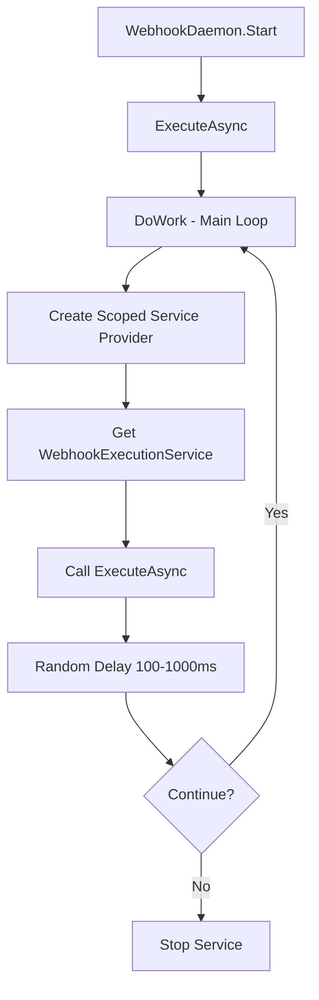

**Key Points:**
- **Background Service**: Runs continuously as a hosted service
- **Scoped Processing**: Creates new scope for each execution cycle
- **Error Isolation**: Each execution is wrapped in try-catch
- **Heartbeat**: Logs every 60 seconds for monitoring

### **2. WebhookExecutionService.ExecuteAsync() - Main Orchestrator**

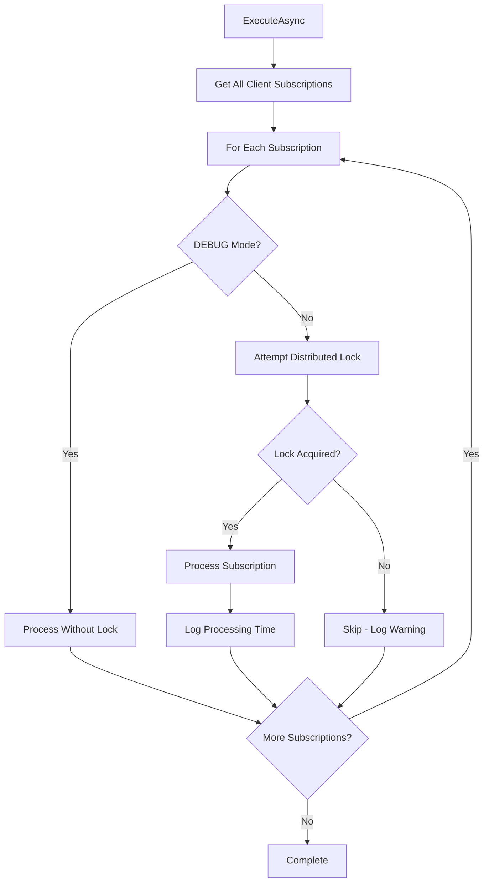

**Distributed Lock Details:**
- **Lock Key**: `webhook-{subscription.SubscriberId}`
- **Expiry**: 60 seconds
- **Wait Time**: 30 seconds
- **Retry Time**: 3 seconds

### **3. ProcessSubscriptionAsync() - Subscription Processing**

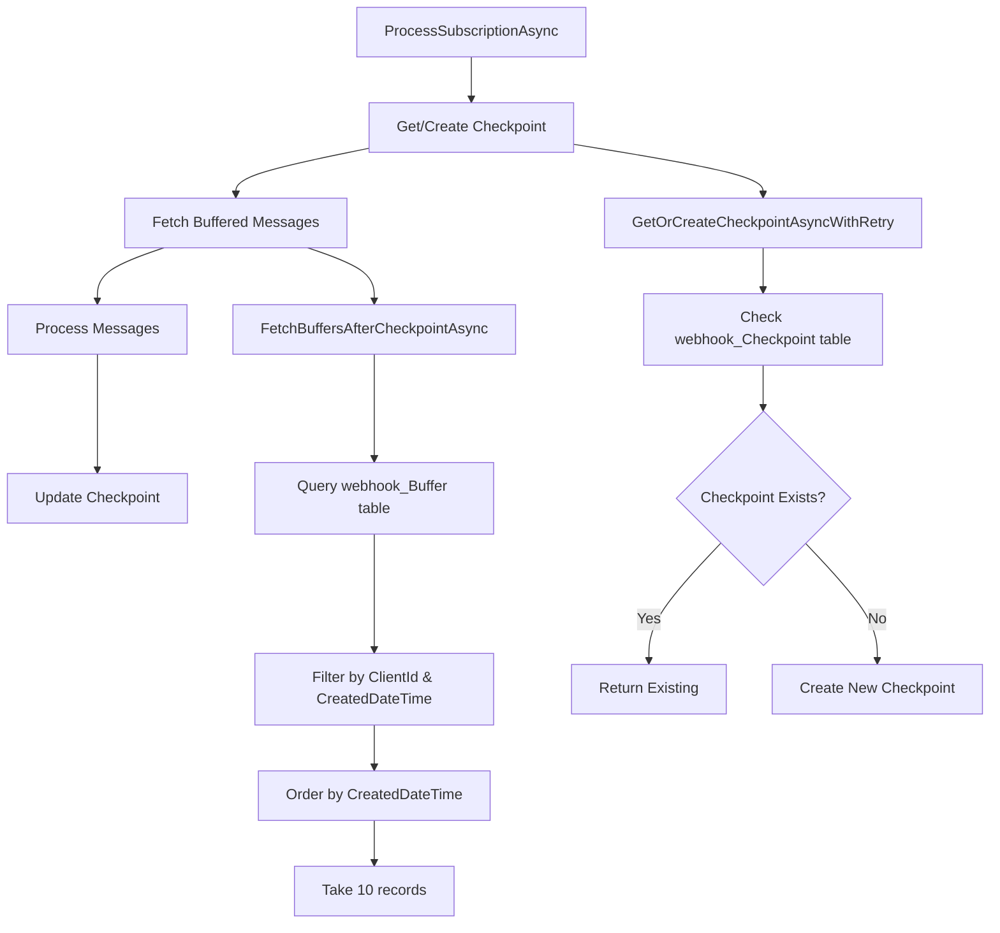

### **4. ProcessMessagesAsync() - Message Processing Loop**

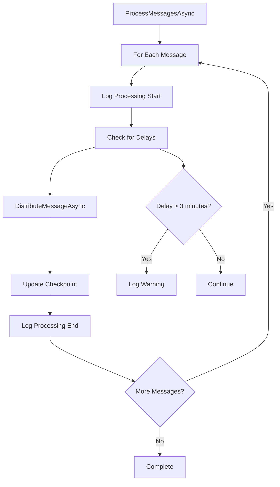

### **5. DistributeMessageAsync() - Message Distribution**

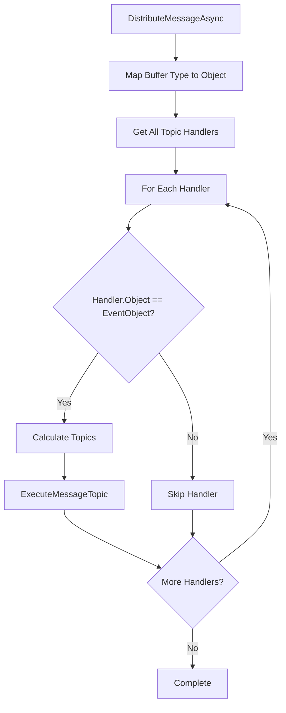

**Topic Calculation:**
```csharp
// Extract changed fields from buffer record
var fields = _buffer.ExtractChangedFields(message);
// Map fields to topics using handler
var mapping = handler.MapFieldsToTopics(fields);
// Get distinct topics
var topics = mapping.SelectMany(x => x.Value).Distinct().ToList();
```

### **6. ExecuteMessageTopic() - Topic Execution**

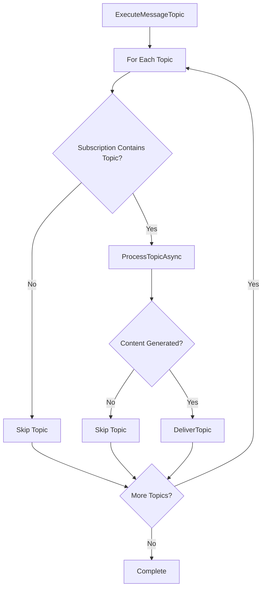

### **7. ProcessTopicAsync() - Content Generation**

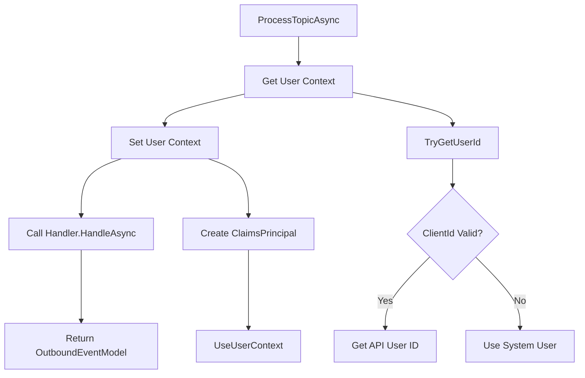

### **8. DeliverTopic() - Topic Delivery**

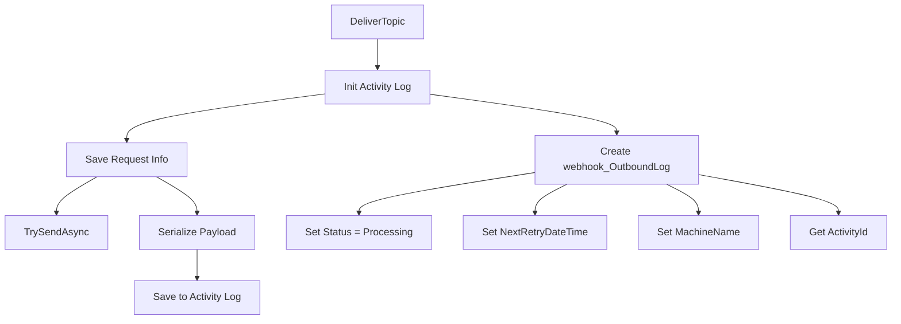

### **9. WebhookSender.TrySendAsync() - HTTP Delivery**

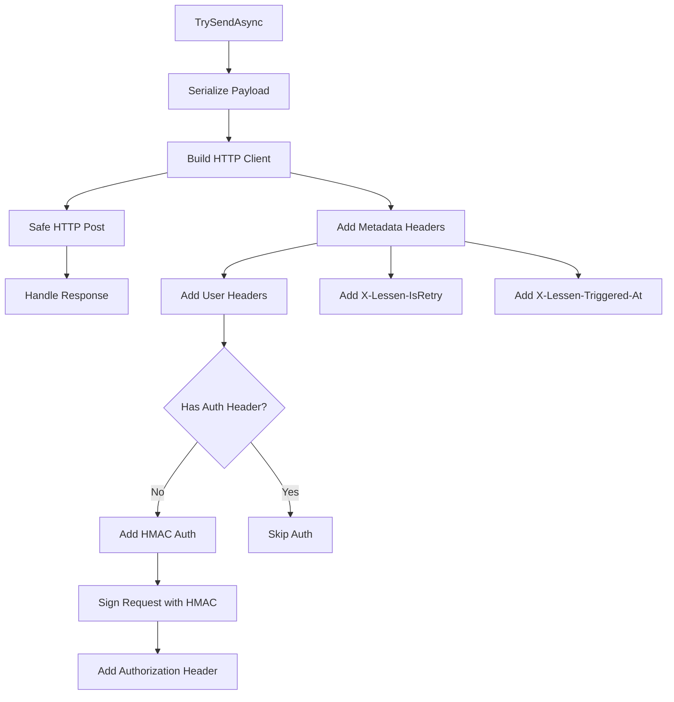

### **10. WebhookResponseHandler.HandleInitialAsync() - Response Processing**

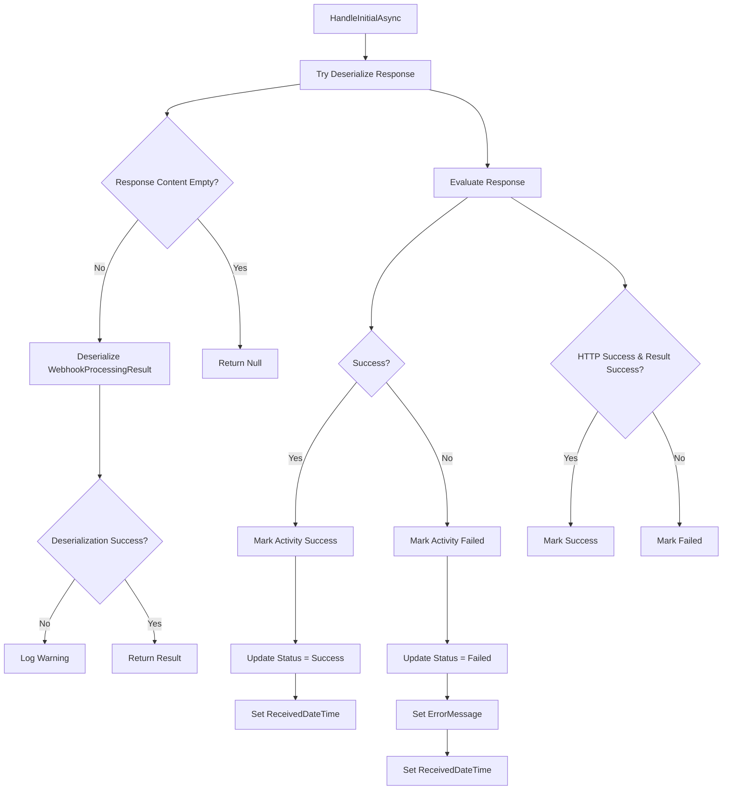

### **11. Retry Mechanism - WebhookRetryService**

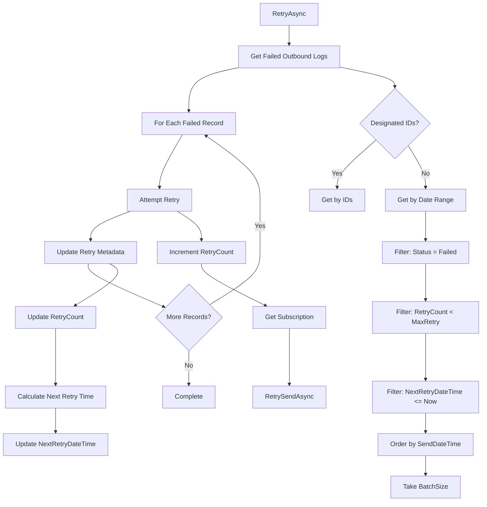

### **12. Database Tables & State Management**

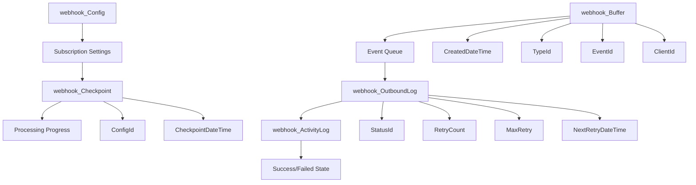

### **13. Error Handling & Resilience**

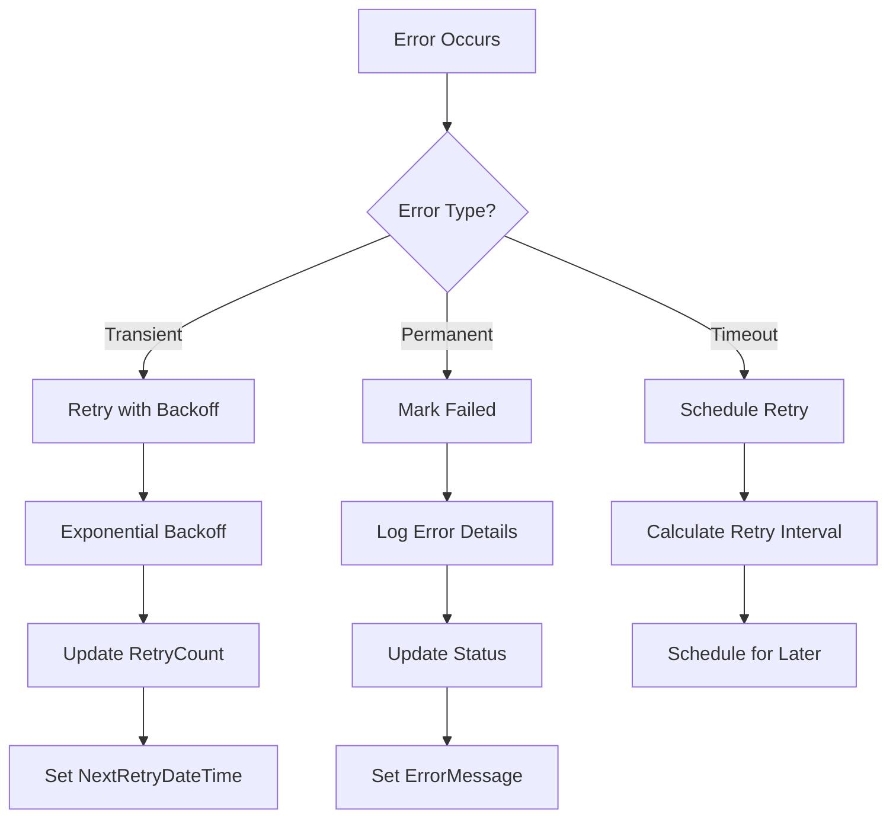

### **14. Performance Monitoring Points**

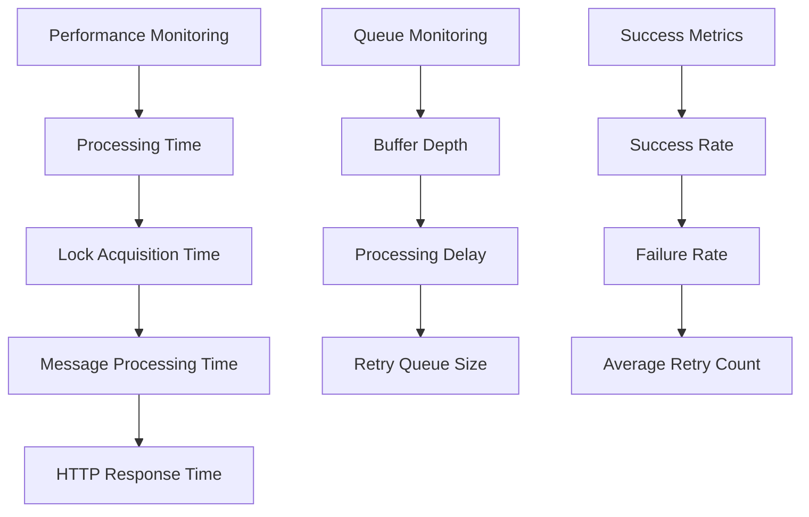

This detailed flow shows how the webhook system processes events from database changes through to successful delivery, with comprehensive error handling, retry mechanisms, and monitoring at each step.

```plaintext
graph TD
    A[WebhookDaemon.Start] --> B[ExecuteAsync]
    B --> C[DoWork - Main Loop]
    C --> D[Create Scoped Service Provider]
    D --> E[Get WebhookExecutionService]
    E --> F[Call ExecuteAsync]
    F --> G[Random Delay 100-1000ms]
    G --> H{Continue?}
    H -->|Yes| C
    H -->|No| I[Stop Service]
```

```plaintext
graph TD
    A[ExecuteAsync] --> B[Get All Client Subscriptions]
    B --> C[For Each Subscription]
    C --> D{DEBUG Mode?}
    D -->|Yes| E[Process Without Lock]
    D -->|No| F[Attempt Distributed Lock]
    F --> G{Lock Acquired?}
    G -->|Yes| H[Process Subscription]
    G -->|No| I[Skip - Log Warning]
    H --> J[Log Processing Time]
    J --> K{More Subscriptions?}
    K -->|Yes| C
    K -->|No| L[Complete]
    E --> K
    I --> K
```

```plaintext
graph TD
    A[ProcessSubscriptionAsync] --> B[Get/Create Checkpoint]
    B --> C[Fetch Buffered Messages]
    C --> D[Process Messages]
    D --> E[Update Checkpoint]
    
    B --> B1[GetOrCreateCheckpointAsyncWithRetry]
    B1 --> B2[Check webhook_Checkpoint table]
    B2 --> B3{Checkpoint Exists?}
    B3 -->|Yes| B4[Return Existing]
    B3 -->|No| B5[Create New Checkpoint]
    
    C --> C1[FetchBuffersAfterCheckpointAsync]
    C1 --> C2[Query webhook_Buffer table]
    C2 --> C3[Filter by ClientId & CreatedDateTime]
    C3 --> C4[Order by CreatedDateTime]
    C4 --> C5[Take 10 records]
```

```plaintext
graph TD
    A[ProcessMessagesAsync] --> B[For Each Message]
    B --> C[Log Processing Start]
    C --> D[Check for Delays]
    D --> E[DistributeMessageAsync]
    E --> F[Update Checkpoint]
    F --> G[Log Processing End]
    G --> H{More Messages?}
    H -->|Yes| B
    H -->|No| I[Complete]
    
    D --> D1{Delay > 3 minutes?}
    D1 -->|Yes| D2[Log Warning]
    D1 -->|No| D3[Continue]
```

```plaintext
graph TD
    A[DistributeMessageAsync] --> B[Map Buffer Type to Object]
    B --> C[Get All Topic Handlers]
    C --> D[For Each Handler]
    D --> E{Handler.Object == EventObject?}
    E -->|No| F[Skip Handler]
    E -->|Yes| G[Calculate Topics]
    G --> H[ExecuteMessageTopic]
    H --> I{More Handlers?}
    I -->|Yes| D
    I -->|No| J[Complete]
    F --> I
```

```csharp
// Extract changed fields from buffer record
var fields = _buffer.ExtractChangedFields(message);
// Map fields to topics using handler
var mapping = handler.MapFieldsToTopics(fields);
// Get distinct topics
var topics = mapping.SelectMany(x => x.Value).Distinct().ToList();
```

```plaintext
graph TD
    A[ExecuteMessageTopic] --> B[For Each Topic]
    B --> C{Subscription Contains Topic?}
    C -->|No| D[Skip Topic]
    C -->|Yes| E[ProcessTopicAsync]
    E --> F{Content Generated?}
    F -->|No| G[Skip Topic]
    F -->|Yes| H[DeliverTopic]
    H --> I{More Topics?}
    I -->|Yes| B
    I -->|No| J[Complete]
    D --> I
    G --> I
```

```plaintext
graph TD
    A[ProcessTopicAsync] --> B[Get User Context]
    B --> C[Set User Context]
    C --> D[Call Handler.HandleAsync]
    D --> E[Return OutboundEventModel]
    
    B --> B1[TryGetUserId]
    B1 --> B2{ClientId Valid?}
    B2 -->|Yes| B3[Get API User ID]
    B2 -->|No| B4[Use System User]
    
    C --> C1[Create ClaimsPrincipal]
    C1 --> C2[UseUserContext]
```

```plaintext
graph TD
    A[DeliverTopic] --> B[Init Activity Log]
    B --> C[Save Request Info]
    C --> D[TrySendAsync]
    
    B --> B1[Create webhook_OutboundLog]
    B1 --> B2[Set Status = Processing]
    B1 --> B3[Set NextRetryDateTime]
    B1 --> B4[Set MachineName]
    B1 --> B5[Get ActivityId]
    
    C --> C1[Serialize Payload]
    C1 --> C2[Save to Activity Log]
```

```plaintext
graph TD
    A[TrySendAsync] --> B[Serialize Payload]
    B --> C[Build HTTP Client]
    C --> D[Safe HTTP Post]
    D --> E[Handle Response]
    
    C --> C1[Add Metadata Headers]
    C1 --> C2[Add User Headers]
    C2 --> C3{Has Auth Header?}
    C3 -->|No| C4[Add HMAC Auth]
    C3 -->|Yes| C5[Skip Auth]
    
    C1 --> C1a[Add X-Lessen-IsRetry]
    C1 --> C1b[Add X-Lessen-Triggered-At]
    
    C4 --> C4a[Sign Request with HMAC]
    C4a --> C4b[Add Authorization Header]
```

```plaintext
graph TD
    A[HandleInitialAsync] --> B[Try Deserialize Response]
    B --> C[Evaluate Response]
    C --> D{Success?}
    D -->|Yes| E[Mark Activity Success]
    D -->|No| F[Mark Activity Failed]
    
    B --> B1{Response Content Empty?}
    B1 -->|Yes| B2[Return Null]
    B1 -->|No| B3[Deserialize WebhookProcessingResult]
    B3 --> B4{Deserialization Success?}
    B4 -->|No| B5[Log Warning]
    B4 -->|Yes| B6[Return Result]
    
    C --> C1{HTTP Success & Result Success?}
    C1 -->|Yes| C2[Mark Success]
    C1 -->|No| C3[Mark Failed]
    
    E --> E1[Update Status = Success]
    E1 --> E2[Set ReceivedDateTime]
    
    F --> F1[Update Status = Failed]
    F1 --> F2[Set ErrorMessage]
    F2 --> F3[Set ReceivedDateTime]
```

```plaintext
graph TD
    A[RetryAsync] --> B[Get Failed Outbound Logs]
    B --> C[For Each Failed Record]
    C --> D[Attempt Retry]
    D --> E[Update Retry Metadata]
    E --> F{More Records?}
    F -->|Yes| C
    F -->|No| G[Complete]
    
    B --> B1{Designated IDs?}
    B1 -->|Yes| B2[Get by IDs]
    B1 -->|No| B3[Get by Date Range]
    
    B3 --> B3a[Filter: Status = Failed]
    B3a --> B3b[Filter: RetryCount < MaxRetry]
    B3b --> B3c[Filter: NextRetryDateTime <= Now]
    B3c --> B3d[Order by SendDateTime]
    B3d --> B3e[Take BatchSize]
    
    D --> D1[Increment RetryCount]
    D1 --> D2[Get Subscription]
    D2 --> D3[RetrySendAsync]
    
    E --> E1[Update RetryCount]
    E1 --> E2[Calculate Next Retry Time]
    E2 --> E3[Update NextRetryDateTime]
```

```plaintext
graph TD
    A[webhook_Buffer] --> B[Event Queue]
    B --> C[webhook_OutboundLog]
    C --> D[webhook_ActivityLog]
    D --> E[Success/Failed State]
    
    F[webhook_Config] --> G[Subscription Settings]
    G --> H[webhook_Checkpoint]
    H --> I[Processing Progress]
    
    A --> A1[CreatedDateTime]
    A --> A2[TypeId]
    A --> A3[EventId]
    A --> A4[ClientId]
    
    C --> C1[StatusId]
    C --> C2[RetryCount]
    C --> C3[MaxRetry]
    C --> C4[NextRetryDateTime]
    
    H --> H1[ConfigId]
    H --> H2[CheckpointDateTime]
```

```plaintext
graph TD
    A[Error Occurs] --> B{Error Type?}
    B -->|Transient| C[Retry with Backoff]
    B -->|Permanent| D[Mark Failed]
    B -->|Timeout| E[Schedule Retry]
    
    C --> C1[Exponential Backoff]
    C1 --> C2[Update RetryCount]
    C2 --> C3[Set NextRetryDateTime]
    
    D --> D1[Log Error Details]
    D1 --> D2[Update Status]
    D2 --> D3[Set ErrorMessage]
    
    E --> E1[Calculate Retry Interval]
    E1 --> E2[Schedule for Later]
```

```plaintext
graph TD
    A[Performance Monitoring] --> B[Processing Time]
    B --> C[Lock Acquisition Time]
    C --> D[Message Processing Time]
    D --> E[HTTP Response Time]
    
    F[Queue Monitoring] --> G[Buffer Depth]
    G --> H[Processing Delay]
    H --> I[Retry Queue Size]
    
    J[Success Metrics] --> K[Success Rate]
    K --> L[Failure Rate]
    L --> M[Average Retry Count]
```

